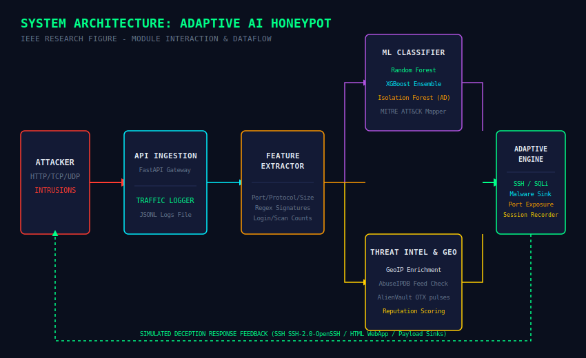
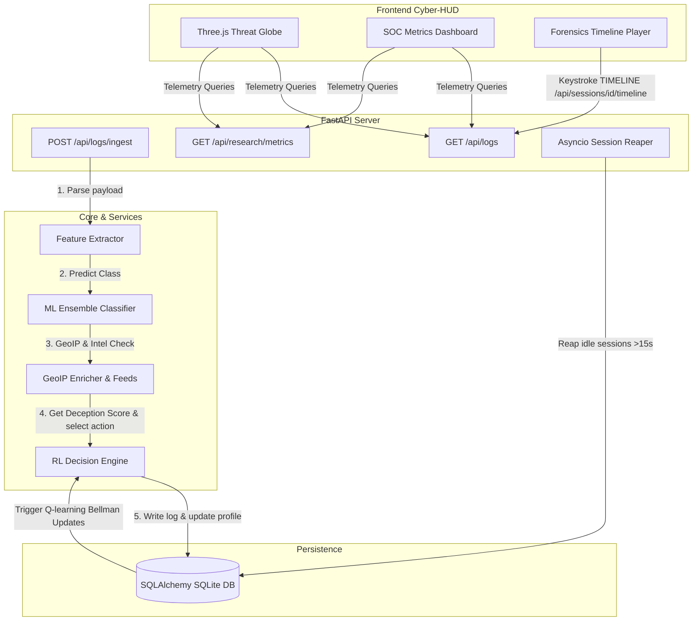
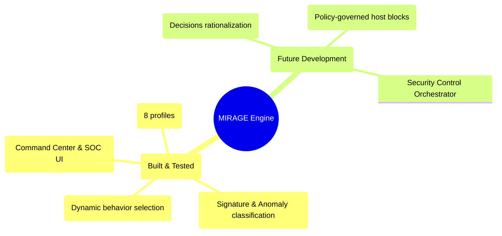

# MIRAGE — Malicious Intent Recognition and Adaptive Genuine Engagement

<p align="center">
  
</p>

<p align="center">
  <strong>Malicious Intent Recognition and Adaptive Genuine Engagement</strong><br/>
  <em>A Research-Grade Stateful Adaptive Honeypot with ML Attack Classification and Closed-Loop Reinforcement Learning Deception.</em>
</p>

<p align="center">
  <a href="https://github.com/nayefsiddique-eng/Adaptive-Honeypot/actions/workflows/ci.yml"></a>
  
  
  
  
  
</p>

---

### Quick Navigation
[Overview](#overview) • [Core Capabilities](#core-capabilities) • [System Architecture](#system-architecture) • [Technical Modules](#technical-modules) • [Setup & Execution](#setup--execution) • [API Endpoint Reference](#api-endpoint-reference) • [ML Evaluation Metrics](#ml-evaluation-metrics) • [Roadmap](#roadmap) • [Citations](#citations)

---

## Overview

**MIRAGE** (Malicious Intent Recognition and Adaptive Genuine Engagement) is an advanced stateful adaptive honeypot designed to classify attacker activity and deploy matching deception layouts dynamically. Using an ensemble of machine learning models (Random Forest and XGBoost) for signature classification, an Isolation Forest for anomaly detection, and a Q-learning reinforcement learning engine, MIRAGE matches defenses directly to the attacker's skill level and tactics.

MIRAGE forms the deception core for **PRAETOR**, a capstone security engineering architecture designed to augment threat engagement with an explainable, policy-governed autonomous response layer.

---

## Core Capabilities

<table width="100%">
  <tr>
    <td width="50%">
      <h4>🛡️ Stateful Deception Profiles</h4>
      Exposes 8 distinct target configurations (e.g., <code>credential_trap</code>, <code>database_decoy</code>, <code>shell_trap</code>, <code>malware_sink</code>, <code>port_expansion</code>, <code>filesystem_decoy</code>, <code>web_decoy</code>, <code>default_monitor</code>) loaded with mock services, custom banners, custom delay loops, and decoy documents.
    </td>
    <td width="50%">
      <h4>🧠 Reinforcement Learning Q-Engine</h4>
      Applies Q-learning algorithms based on the Bellman equation to map incoming attacks, track intrusion session depths, and dynamically calculate reward feedback to select optimal deception postures session-over-session.
    </td>
  </tr>
  <tr>
    <td width="50%">
      <h4>📊 Live Cyber-HUD Operation Cockpit</h4>
      A modular CSS-grid portal utilizing a futuristic theme. Features a 3D threat globe (Three.js) mapping geo markers (Leaflet.js) alongside Chart.js gauges tracking kill chain progressions.
    </td>
    <td width="50%">
      <h4>🕵️ Forensics & Keystroke Tracking</h4>
      Logs command line payloads and captures SHA-256 binary check hashes. Builds chronological attacker behavior timelines plotting session delta timing offsets.
    </td>
  </tr>
  <tr>
    <td width="50%">
      <h4>📡 Threat Intelligence Feeds</h4>
      Queries visitor reputations on-the-fly against AbuseIPDB and AlienVault OTX servers, leveraging local caching to prevent API rate-limit bottlenecks.
    </td>
    <td width="50%">
      <h4>🤖 LLM Summary Reports</h4>
      Generates analyst-grade summary briefings detailing attacker activities, leveraging the Google Gemini API (cached in SQLite database).
    </td>
  </tr>
</table>

---

## System Architecture



---

## Technical Modules

* **`backend/main.py`**: FastAPIs startup engine. Spin-locks the **Asyncio Session Reaper** background thread which closes sessions idle for more than 15 seconds, attributing Bellman rewards and writing Q-values back to the database.
* **`backend/core/rl_engine.py`**: Houses the Q-learning policy loops. Resolves exploratory epsilon-greedy configurations, tracks state serialization hashes, and evaluates engagement durations and deception scores to reward the agent.
* **`backend/core/decision_engine.py`**: Stores configurations for the 8 stateful profiles, maintaining ports, mock file arrays, and delay times. Contains heuristics to match standard kill chain stages.
* **`backend/api/logs.py`**: Primary ingress point `/api/logs/ingest`. Validates network schemas, runs ML predictors, appends geolocation parameters, and interacts with the Q-learning engine before logging to SQLite.

---

## Setup & Execution

### 1. Clone & Initialize Environment
```bash
git clone https://github.com/nayefsiddique-eng/Adaptive-Honeypot.git
cd Adaptive-Honeypot
python -m venv venv
# On Windows
.\venv\Scripts\activate
# On Linux/macOS
source venv/bin/activate
```

### 2. Install Packages
```bash
python -m pip install --upgrade pip
python -m pip install -r requirements.txt
```

### 3. Generate ML Pipeline Models
Generate the trained models and evaluate performance metrics:
```bash
python ml/train_classifier.py
python ml/evaluate_models.py
```

### 4. Boot the FastAPI Server
```bash
python -m uvicorn backend.main:app --port 8000
```
FastAPI Swagger documentation is accessible at `http://localhost:8000/docs`.

### 5. Launch the Traffic Attack Simulator
In a separate terminal, launch the closed-loop multi-step attacker simulation script:
```bash
python scripts/simulate_attacks.py --count 15 --delay 0.5 --session-delay 1.0
```

### 6. Start the Cyber-HUD Frontend
Open `frontend/index.html` directly in any web browser. It operates on `file://` protocol and queries the backend at `http://localhost:8000`.

---

## API Endpoint Reference

All endpoints are public and do not require authentication for research demonstrations.

| Method | Path | Description |
| :--- | :--- | :--- |
| `GET` | `/` | API Health verification and honeypot active check. |
| `POST` | `/api/logs/ingest` | Logs raw traffic, extracts features, predicts class, geolocates, and queries the RL decision module. |
| `GET` | `/api/logs` | Fetch all logs (supports filter: `?ip={ip_address}`). |
| `POST` | `/api/decisions/evaluate` | Standard heuristic evaluation. |
| `POST` | `/api/decisions/evaluate_rl` | Dynamic reinforcement learning evaluation using Q-learning matrices. |
| `GET` | `/api/sessions` | Fetch all attacker session cards including chain statuses. |
| `GET` | `/api/sessions/{id}/behavior_timeline` | Reconstruct attacker delta-time event timeline for forensic logs. |
| `GET` | `/api/research/metrics` | Fetch IEEE evaluation data (contains cache hits, false-positives, latencies). |
| `GET` | `/api/research/learning-curve` | Get session sequential running average rewards tracking Q-convergence. |
| `POST` | `/api/admin/reset-demo` | Resets SQLite database tables (`honeypot.db`). |
| `POST` | `/api/admin/close-sessions` | Instantly close active sessions to trigger immediate learning updates. |

---

## ML Evaluation Metrics

Verified ML model performance metrics extracted from `ml/models/evaluation_results.json`:

| Model Classifier | Accuracy | Precision | Recall | F1-Score |
| :--- | :---: | :---: | :---: | :---: |
| **Random Forest** | 100.00% | 100.00% | 100.00% | 100.00% |
| **XGBoost** | 100.00% | 100.00% | 100.00% | 100.00% |
| **Isolation Forest** | 97.08% | 88.30% | 88.30% | 88.30% |

---

## Roadmap



---

## Citations

If you use this system for academic work, please reference the working IEEE draft paper:

```bibtex
@ARTICLE{MIRAGE2026,
  author={Siddique, Nayef},
  journal={IEEE Transactions on Information Forensics and Security},
  title={MIRAGE: An Adaptive AI-Based Honeypot for Intelligent Cyber Threat Deception},
  year={2026},
  note={Under Review}
}
```