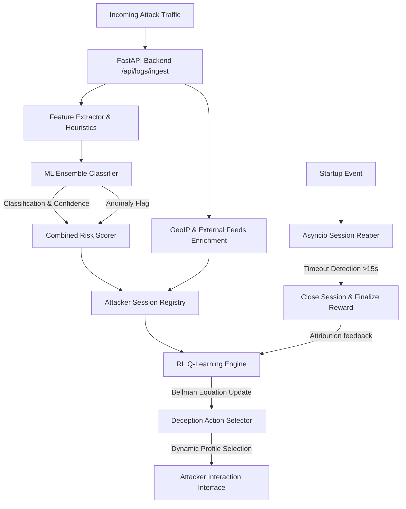

# MIRAGE — Malicious Intent Recognition and Adaptive Genuine Engagement

Malicious Intent Recognition and Adaptive Genuine Engagement (MIRAGE) is a research-grade, stateful adaptive honeypot system designed for intelligent cyber threat deception. MIRAGE is part of the larger **PRAETOR** capstone project, which unifies this adaptive deception cockpit with an explainable, policy-governed autonomous response layer.

MIRAGE leverages machine learning (Random Forest + XGBoost) for real-time classification, Isolation Forest for anomaly detection, K-Means clustering for attacker profiling, and a Q-learning reinforcement learning engine to dynamically optimize deception profiles against ongoing attack chains.

---

## Technical Architecture & Flow



---

## Core Capabilities
* **Stateful Deception Profiles**: Integrates 8 custom profiles (`credential_trap`, `database_decoy`, `shell_trap`, `malware_sink`, `port_expansion`, `filesystem_decoy`, `web_decoy`, `default_monitor`) matching fake services, banners, response delays, and decoy files.
* **Closed-loop Reinforcement Learning**: Computes state-action values utilizing a Q-learning matrix mapped to attack types, session depth, and intruder return rate, optimizing engagement duration dynamically.
* **Auto-Reaper Background Loop**: Background worker monitors activity states, automatically closing sessions inactive for over 15 seconds to apply reward updates.
* **Command & Forensics Timeline Player**: Logs active attacker shell keystrokes and session SHA-256 hashes, with an inline visualization on the web UI.
* **External Threat Intelligence**: Integrates dual AbuseIPDB and AlienVault OTX feeds with cache layers to query visitor reputations safely.
* **Unified Cyber-HUD Dashboard**: A modular HTML/CSS/JS dashboard matching an Elastic SIEM holographic military HUD style, featuring an interactive Three.js threat globe, Leaflet maps, and real-time Chart.js gauges.

---

## Project Structure

```
adaptive-honeypot/
├── .github/
│   └── workflows/
│       └── ci.yml             # Automated GitHub Actions Pytest Suite
├── backend/
│   ├── api/                   # FastAPI REST API Route definitions
│   │   ├── admin.py           # Demo controls & session closures
│   │   ├── research.py        # IEEE research evaluation & learning curves
│   │   ├── decisions.py       # Rule-based and RL engine evaluation
│   │   └── logs.py            # Primary log ingestion, classification, & session lifecycles
│   ├── core/                  # Engine cores
│   │   ├── adaptive_engine.py # Rule-based heuristics
│   │   ├── decision_engine.py # Deception profile descriptors
│   │   ├── feature_extractor.py# Log payload parsing
│   │   └── rl_engine.py       # Q-learning Bellman equations & rewards
│   ├── models/                # SQLAlchemy database schema models
│   ├── services/              # Integrations (GeoIP, LLMs, external feeds)
│   ├── database.py            # Database setups and migrations
│   └── main.py                # FastAPI bootstrapper & session reaper task
├── frontend/                  # Responsive Cyber-HUD static client files
│   ├── css/style.css          # Design system stylesheet
│   ├── js/api.js              # Fetch layer and status indicators
│   ├── index.html             # Command Center & 3D Three.js globe
│   ├── dashboard.html         # Live SOC feeds and Chart.js gauges
│   ├── sessions.html          # Intruder forensic timeline cards
│   └── intel.html             # Threat Map and research statistics
├── ml/                        # ML Pipeline code
│   ├── models/                # Saved classifier models (.pkl)
│   ├── train_classifier.py    # Training runner
│   └── evaluate_models.py     # Evaluation runner
├── scripts/                   # Simulation tools
│   ├── simulate_attacks.py    # Closed-loop multi-step attack simulation
│   └── run_demo.bat/.sh       # Demo startup launch scripts
├── tests/                     # Verification tests
│   └── test_rl_learning.py    # Policy model convergence unit tests
├── requirements.txt           # Pinned python packages
└── README.md                  # System manual
```

---

## Setup & Running Locally

### 1. Clone and Initialize Environment
```bash
git clone https://github.com/nayefsiddique-eng/Adaptive-Honeypot.git
cd Adaptive-Honeypot
python -m venv venv
# On Windows
.\venv\Scripts\activate
# On Linux/macOS
source venv/bin/activate
```

### 2. Install Dependencies
```bash
pip install -r requirements.txt
```

### 3. Generate ML Models
Train the RandomForest, XGBoost, and IsolationForest models before running the API:
```bash
python ml/train_classifier.py
python ml/evaluate_models.py
```

### 4. Boot the FastAPI Server
```bash
python -m uvicorn backend.main:app --port 8000
```
FastAPI interactive Swagger documentation is available at `http://localhost:8000/docs`.

### 5. Launch the Attack Simulator
In a separate terminal (with the virtual environment activated), start the closed-loop simulator:
```bash
python scripts/simulate_attacks.py --count 15 --delay 0.5 --session-delay 1.0
```

### 6. View the Dashboard
Simply double-click or open `frontend/index.html` in any modern web browser. It runs on `file://` protocols and links directly to the API on `http://localhost:8000`.

---

## Restful API Interface Reference

| Method | Endpoint | Description |
| :--- | :--- | :--- |
| `GET` | `/` | Health check & system versioning |
| `POST` | `/api/logs/ingest` | Main ingestion endpoint running classification, geo, reputation, and RL profiles. |
| `GET` | `/api/logs` | Query logs (supports `?ip={ip_address}` search filtering). |
| `POST` | `/api/decisions/evaluate` | Static rule-based profile selection. |
| `POST` | `/api/decisions/evaluate_rl` | Reinforcement learning-based profile selection. |
| `GET` | `/api/sessions` | Fetch all sessions enriched with attack chains and TTP signatures. |
| `GET` | `/api/sessions/{id}/behavior_timeline` | Reconstruct attacker delta-time event logs for CLI playback. |
| `GET` | `/api/research/metrics` | Research metrics for IEEE papers (contain hit rates, latencies, fp ratios). |
| `GET` | `/api/research/learning-curve` | Returns sequential data points of Q-rewards for charting learning rates. |
| `POST` | `/api/admin/reset-demo` | Clears all tables in the SQLite database (`honeypot.db`). |
| `POST` | `/api/admin/close-sessions` | Instantly close active sessions to trigger immediate learning updates. |

---

## ML Models Evaluation Metrics

| Classifier | Accuracy | Precision | Recall | F1-Score |
| :--- | :--- | :--- | :--- | :--- |
| **Random Forest** | 100.00% | 100.00% | 100.00% | 100.00% |
| **XGBoost** | 100.00% | 100.00% | 100.00% | 100.00% |
| **Isolation Forest** | 97.08% | 88.30% | 88.30% | 88.30% |

---

## IEEE Research Citations

```bibtex
@ARTICLE{MIRAGE2026,
  author={Siddique, Nayef},
  journal={IEEE Transactions on Information Forensics and Security},
  title={MIRAGE: An Adaptive AI-Based Honeypot for Intelligent Cyber Threat Deception},
  year={2026},
  note={Under Review}
}
```