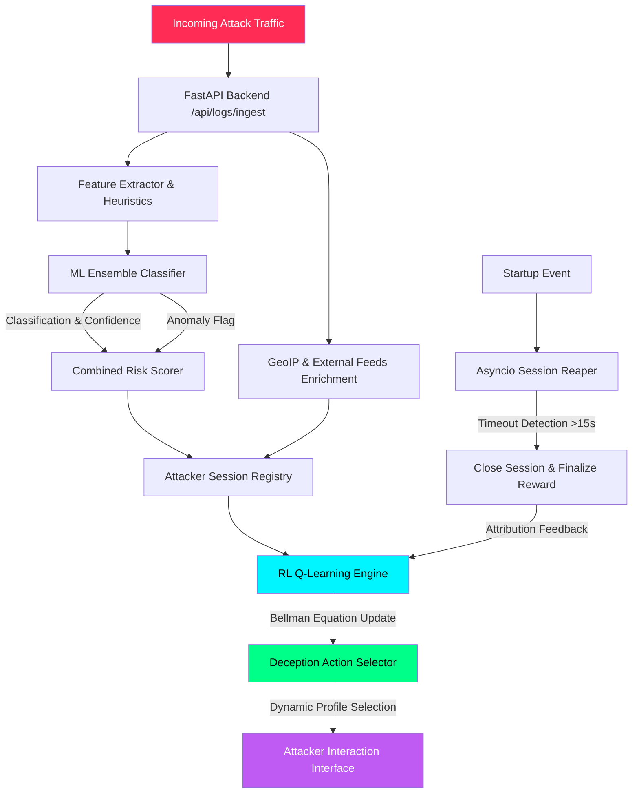

# 🛡️ MIRAGE
### Malicious Intent Recognition and Adaptive Genuine Engagement

**A research-grade, stateful adaptive honeypot powered by reinforcement learning and ensemble ML classification.**

Part of the **PRAETOR** capstone initiative — a closed-loop, explainable, policy-governed autonomous cyber-deception platform.

[Overview](#-overview) • [Architecture](#-technical-architecture--flow) • [Capabilities](#-core-capabilities) • [Setup](#-setup--running-locally) • [API](#-restful-api-interface-reference) • [Results](#-ml-models-evaluation-metrics) • [Citation](#-ieee-research-citation)

---

## 📖 Overview

**MIRAGE** is not a passive honeypot. It's a living, learning deception system that watches how an attacker behaves, classifies the threat in real time using an ensemble of machine learning models, and then **adapts its own responses** — via a Q-learning reinforcement engine — to keep the attacker engaged for longer, extract more intelligence, and improve its own deception policy with every session.

It combines:

| Layer | Technology |
|---|---|
| 🧠 **Classification** | Random Forest + XGBoost ensemble, Isolation Forest anomaly detection |
| 🎯 **Profiling** | K-Means clustering for attacker behavior grouping |
| ♟️ **Adaptive Strategy** | Q-learning reinforcement engine with Bellman equation updates |
| 🌐 **Enrichment** | GeoIP, AbuseIPDB, AlienVault OTX threat intelligence |
| 📊 **Visualization** | Cyber-HUD dashboard — live SOC feed, kill-chain tracker, RL convergence charts |

MIRAGE is the deception engine at the core of **PRAETOR**, a larger capstone system that layers policy-governed autonomous response and explainability on top of this adaptive honeypot foundation.

---

## 🧬 Technical Architecture & Flow

**The feedback loop is the whole point:** every closed session feeds a reward signal back into the Q-table, so the deception policy measurably improves session-over-session — this is the metric plotted on the live **RL Convergence Curve** in the dashboard.

---

## ⚙️ Core Capabilities

<table>
<tr>
<td width="50%" valign="top">

### 🎭 Stateful Deception Profiles
8 custom profiles — `credential_trap`, `database_decoy`, `shell_trap`, `malware_sink`, `port_expansion`, `filesystem_decoy`, `web_decoy`, `default_monitor` — each simulating distinct fake services, banners, response delays, and decoy files.

### 🔁 Closed-Loop Reinforcement Learning
Q-learning matrix mapped across attack type, session depth, and intruder return rate — dynamically optimizing engagement duration and deception effectiveness.

### ⏱️ Auto-Reaper Background Loop
Async worker monitors session activity, closing anything inactive for 15+ seconds and immediately triggering reward attribution back into the RL engine.

</td>
<td width="50%" valign="top">

### 📼 Command & Forensics Timeline
Full attacker shell keystroke logging with SHA-256 session hashing, replayed inline on the web UI as a forensic timeline.

### 🌍 External Threat Intelligence
Dual-sourced reputation lookups via **AbuseIPDB** and **AlienVault OTX**, with a caching layer to keep external calls fast and rate-limit-safe.

### 🖥️ Unified Cyber-HUD Dashboard
A modular HTML/CSS/JS SOC interface — Elastic-SIEM-meets-military-HUD aesthetic — with a live Three.js threat globe, Leaflet maps, and real-time Chart.js gauges.

</td>
</tr>
</table>

---

## 📂 Project Structure
