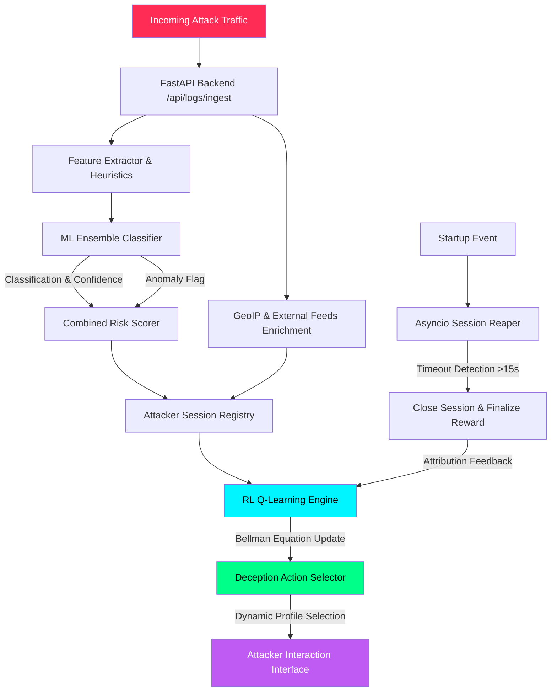
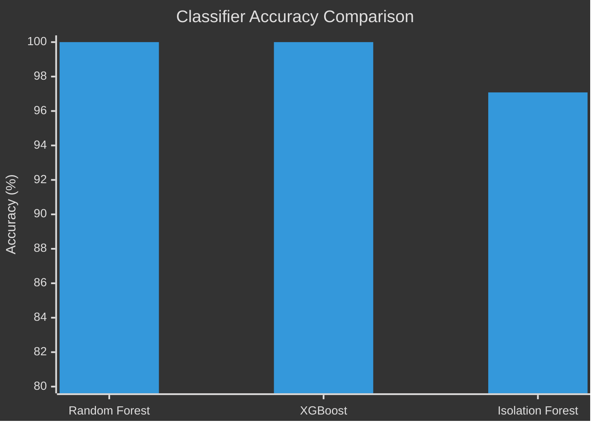
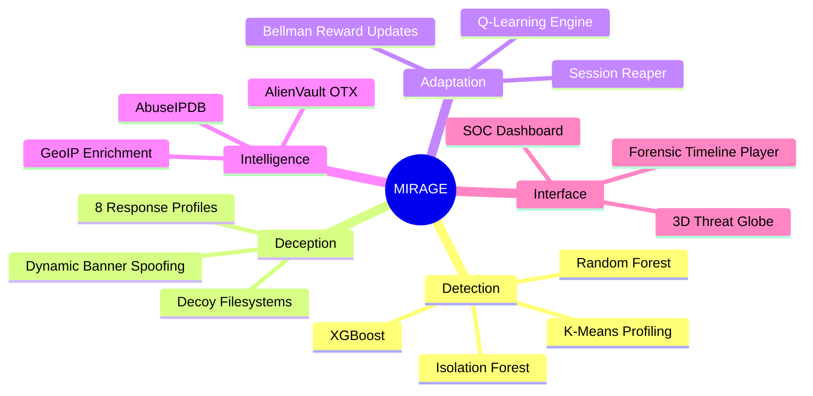

<div align="center">

# 🛡️ MIRAGE
### Malicious Intent Recognition and Adaptive Genuine Engagement

**A research-grade, stateful adaptive honeypot powered by reinforcement learning and ensemble ML classification.**

Part of the **PRAETOR** capstone initiative — a closed-loop, explainable, policy-governed autonomous cyber-deception platform.

[](https://www.python.org/)
[](https://fastapi.tiangolo.com/)
[](https://www.sqlalchemy.org/)
[](https://scikit-learn.org/)
[](https://xgboost.readthedocs.io/)
[](#license)

[](https://github.com/nayefsiddique-eng/Adaptive-Honeypot/actions)


[Overview](#-overview) • [Architecture](#-technical-architecture--flow) • [Capabilities](#-core-capabilities) • [Setup](#-setup--running-locally) • [API](#-restful-api-interface-reference) • [Results](#-ml-models-evaluation-metrics) • [Citation](#-ieee-research-citation)

</div>

---

## 📖 Overview

**MIRAGE** is not a passive honeypot. It's a living, learning deception system that watches how an attacker behaves, classifies the threat in real time using an ensemble of machine learning models, and then **adapts its own responses** — via a Q-learning reinforcement engine — to keep the attacker engaged for longer, extract more intelligence, and improve its own deception policy with every session.

It combines:

| Layer | Technology |
|---|---|
| 🧠 **Classification** | Random Forest + XGBoost ensemble, Isolation Forest anomaly detection |
| 🎯 **Profiling** | K-Means clustering for attacker behavior grouping |
| ♟️ **Adaptive Strategy** | Q-learning reinforcement engine with Bellman equation updates |
| 🌐 **Enrichment** | GeoIP, AbuseIPDB, AlienVault OTX threat intelligence |
| 📊 **Visualization** | Cyber-HUD dashboard — live SOC feed, kill-chain tracker, RL convergence charts |

MIRAGE is the deception engine at the core of **PRAETOR**, a larger capstone system that layers policy-governed autonomous response and explainability on top of this adaptive honeypot foundation.

---

## 🧬 Technical Architecture & Flow



**The feedback loop is the whole point:** every closed session feeds a reward signal back into the Q-table, so the deception policy measurably improves session-over-session — this is the metric plotted on the live **RL Convergence Curve** in the dashboard.

---

## ⚙️ Core Capabilities

<table>
<tr>
<td width="50%" valign="top">

### 🎭 Stateful Deception Profiles
8 custom profiles — `credential_trap`, `database_decoy`, `shell_trap`, `malware_sink`, `port_expansion`, `filesystem_decoy`, `web_decoy`, `default_monitor` — each simulating distinct fake services, banners, response delays, and decoy files.

### 🔁 Closed-Loop Reinforcement Learning
Q-learning matrix mapped across attack type, session depth, and intruder return rate — dynamically optimizing engagement duration and deception effectiveness.

### ⏱️ Auto-Reaper Background Loop
Async worker monitors session activity, closing anything inactive for 15+ seconds and immediately triggering reward attribution back into the RL engine.

</td>
<td width="50%" valign="top">

### 📼 Command & Forensics Timeline
Full attacker shell keystroke logging with SHA-256 session hashing, replayed inline on the web UI as a forensic timeline.

### 🌍 External Threat Intelligence
Dual-sourced reputation lookups via **AbuseIPDB** and **AlienVault OTX**, with a caching layer to keep external calls fast and rate-limit-safe.

### 🖥️ Unified Cyber-HUD Dashboard
A modular HTML/CSS/JS SOC interface — Elastic-SIEM-meets-military-HUD aesthetic — with a live Three.js threat globe, Leaflet maps, and real-time Chart.js gauges.

</td>
</tr>
</table>

---

## 📂 Project Structure

```
adaptive-honeypot/
├── .github/
│   └── workflows/
│       └── tests.yml          # Automated GitHub Actions pytest suite
├── backend/
│   ├── api/                    # FastAPI REST route definitions
│   │   ├── admin.py             # Demo controls & session closures
│   │   ├── research.py          # IEEE research metrics & RL learning curves
│   │   ├── decisions.py         # Rule-based and RL engine evaluation
│   │   └── logs.py              # Log ingestion, classification, session lifecycle
│   ├── core/                   # Engine cores
│   │   ├── adaptive_engine.py   # Rule-based heuristics
│   │   ├── decision_engine.py   # Deception profile descriptors
│   │   ├── feature_extractor.py # Log payload parsing
│   │   └── rl_engine.py         # Q-learning Bellman equations & rewards
│   ├── models/                 # SQLAlchemy database schema models
│   ├── services/                # GeoIP, LLM summarizer, external feed integrations
│   ├── database.py              # DB setup & migrations
│   └── main.py                  # FastAPI bootstrapper & session reaper task
├── frontend/                   # Cyber-HUD static client
│   ├── css/style.css
│   ├── js/api.js
│   ├── index.html               # Command center & 3D threat globe
│   ├── dashboard.html           # Live SOC feed, kill-chain tracker, RL curve
│   ├── sessions.html            # Attacker forensic timeline cards
│   └── intel.html               # Threat map & research statistics
├── ml/
│   ├── models/                  # Saved classifier models (.pkl)
│   ├── train_classifier.py
│   └── evaluate_models.py
├── scripts/
│   ├── simulate_attacks.py      # Closed-loop multi-step attack simulator
│   └── run_demo.bat / .sh
├── tests/
│   └── test_rl_learning.py      # Policy convergence unit tests
├── requirements.txt
└── README.md
```

---

## 🚀 Setup & Running Locally

### 1️⃣ Clone & initialize environment

```bash
git clone https://github.com/nayefsiddique-eng/Adaptive-Honeypot.git
cd Adaptive-Honeypot
python -m venv venv

# Windows
.\venv\Scripts\activate
# Linux/macOS
source venv/bin/activate
```

### 2️⃣ Install dependencies

```bash
pip install -r requirements.txt
```

### 3️⃣ Train the ML models

```bash
python ml/train_classifier.py
python ml/evaluate_models.py
```

### 4️⃣ Boot the FastAPI server

```bash
python -m uvicorn backend.main:app --port 8000
```

Interactive Swagger docs live at **http://localhost:8000/docs**

### 5️⃣ Run the attack simulator

```bash
python scripts/simulate_attacks.py --count 15 --delay 0.5 --session-delay 1.0
```

### 6️⃣ Open the dashboard

Just open `frontend/index.html` in any modern browser — it runs over `file://` and talks directly to `http://localhost:8000`.

---

## 🔌 RESTful API Interface Reference

| Method | Endpoint | Description |
|:---:|---|---|
| `GET` | `/` | Health check & system versioning |
| `POST` | `/api/logs/ingest` | Main ingestion — classification, geo, reputation, RL profile selection |
| `GET` | `/api/logs` | Query logs (`?ip={ip_address}` filter supported) |
| `POST` | `/api/decisions/evaluate` | Static rule-based profile selection |
| `POST` | `/api/decisions/evaluate_rl` | Reinforcement learning-based profile selection |
| `GET` | `/api/sessions` | All sessions enriched with attack chains & TTP signatures |
| `GET` | `/api/sessions/{id}/behavior_timeline` | Reconstructed attacker event log for CLI playback |
| `GET` | `/api/research/metrics` | IEEE-grade research metrics — hit rates, latencies, FP ratios |
| `GET` | `/api/research/learning-curve` | Sequential Q-reward data points for RL convergence charting |
| `POST` | `/api/admin/reset-demo` | Wipes all tables in `honeypot.db` |
| `POST` | `/api/admin/close-sessions` | Force-closes active sessions to trigger immediate learning updates |

---

## 📊 ML Models Evaluation Metrics

<div align="center">

| Classifier | Accuracy | Precision | Recall | F1-Score |
|:---|:---:|:---:|:---:|:---:|
| 🌲 **Random Forest** | `100.00%` | `100.00%` | `100.00%` | `100.00%` |
| ⚡ **XGBoost** | `100.00%` | `100.00%` | `100.00%` | `100.00%` |
| 🔍 **Isolation Forest** | `97.08%` | `88.30%` | `88.30%` | `88.30%` |

</div>



---

## 🧩 System at a Glance



---

## 📜 IEEE Research Citation

```bibtex
@ARTICLE{MIRAGE2026,
  author={Siddique, Nayef},
  journal={IEEE Transactions on Information Forensics and Security},
  title={MIRAGE: An Adaptive AI-Based Honeypot for Intelligent Cyber Threat Deception},
  year={2026},
  note={Under Review}
}
```

---

## 🗺️ Roadmap — PRAETOR Integration

- [x] Ensemble ML classification pipeline
- [x] Q-learning adaptive deception engine
- [x] Cyber-HUD SOC dashboard with live RL convergence tracking
- [x] External threat intelligence enrichment
- [ ] Policy-governed autonomous response layer (PRAETOR core)
- [ ] Explainability module (SHAP-based decision rationale surfaced in UI)
- [ ] Co-training loop between MIRAGE deception signals and PRAETOR policy engine

---

<div align="center">

**Built by [Nayef Siddique](https://github.com/nayefsiddique-eng)** — Final Year B.E. Computer Science, AI & Cybersecurity

⭐ If this project interests you, consider starring the repo!

</div>
