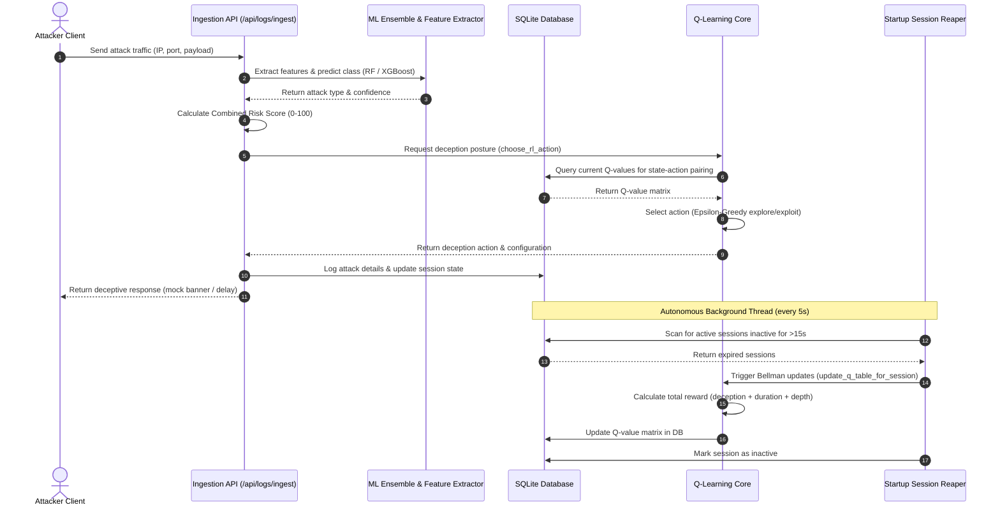
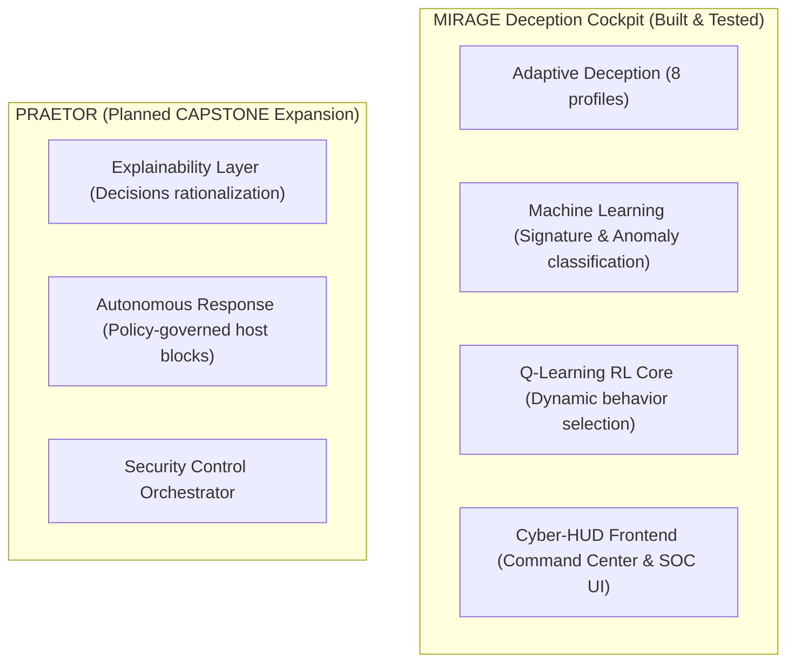

# MIRAGE — Malicious Intent Recognition and Adaptive Genuine Engagement

<p align="center">
  
</p>

<p align="center">
  <strong>"A cybersecurity cockpit that learns to lie better the longer it interacts with an attacker."</strong>
</p>

<p align="center">
  <a href="https://github.com/nayefsiddique-eng/Adaptive-Honeypot/actions/workflows/ci.yml"></a>
  
  
  
  
  
</p>

---

### Quick Navigation
[Overview](#-overview) • [Core Capabilities](#-core-capabilities) • [System Architecture](#-system-architecture) • [Technical Modules](#-technical-modules) • [Setup & Execution](#-setup--execution) • [API Endpoint Reference](#-api-endpoint-reference) • [ML Evaluation Metrics](#-ml-evaluation-metrics) • [Project Structure](#-project-structure) • [Roadmap](#-roadmap) • [Citations](#-citations)

---

## ⚡ At a Glance

<p align="center">
  🧪 <strong>3 ML Model Classifiers</strong> &nbsp;&bull;&nbsp; 
  🛡️ <strong>8 Stateful Deception Profiles</strong> &nbsp;&bull;&nbsp; 
  📡 <strong>27 REST API Routes</strong> &nbsp;&bull;&nbsp; 
  🔄 <strong>15s Auto-Reaper Loop</strong>
</p>

### Why this matters:
* **Active Threat Engagement**: Instead of static honeypots that attackers quickly identify, MIRAGE dynamically changes its ports, banners, and decoy structures mid-session to mimic authentic systems.
* **Closed-loop Adaptability**: Automatically evaluates attacker persistence, scaling decoy complexity (e.g. accepting credentials, exposing MySQL tables, slowing connections) based on reward optimization.
* **Forensic Keystroke Reconstruction**: Captures command lines and logs payloads in sequence, mapping actions to standard MITRE ATT&CK techniques.
* **Academic Submission Standard**: Synthesizes response latencies, cache rates, and false-positive ratios to yield empirical metrics suitable for peer-reviewed evaluation.

---

## 🔍 Overview

**MIRAGE** (Malicious Intent Recognition and Adaptive Genuine Engagement) is an adaptive cyber-deception engine. It uses a Random Forest and XGBoost classification ensemble to identify attack types in real time, an Isolation Forest to flag anomalous or zero-day payloads, and a Q-learning reinforcement learning engine to dynamically optimize deception profiles based on attacker feedback.

MIRAGE operates as the telemetry core of **PRAETOR**, a capstone system adding policy-governed host responses and explainability layers on top of adaptive threat engagement.

---

## 🛡️ Core Capabilities

<table width="100%">
  <tr>
    <td width="50%">
      <h4>🎭 Stateful Deception Vectors</h4>
      Serves 8 deception environments (e.g., <code>credential_trap</code>, <code>database_decoy</code>, <code>shell_trap</code>, <code>malware_sink</code>, <code>port_expansion</code>, <code>filesystem_decoy</code>, <code>web_decoy</code>, <code>default</code>) loaded with distinct ports, banners, responsive traps, and decoy document templates.
    </td>
    <td width="50%">
      <h4>🧠 Reinforcement Learning Q-Engine</h4>
      Applies Q-learning matrix loops (Bellman updates) mapped to attacker return rates, session depths, and configuration profiles to calculate optimal defense states session-over-session.
    </td>
  </tr>
  <tr>
    <td width="50%">
      <h4>📊 Live Cyber-HUD Cockpit</h4>
      Modular multi-page static portal featuring a 3D threat globe (Three.js), clustered Leaflet geolocation mapping, and live Chart.js gauges mapping attack chain progress.
    </td>
    <td width="50%">
      <h4>🔐 Forensic Keystroke Tracking</h4>
      Logs interactive shell payloads, isolates binary drops for SHA-256 integrity validation, and compiles chronological attacker behavior timelines.
    </td>
  </tr>
  <tr>
    <td width="50%">
      <h4>📡 Threat Intelligence Feeds</h4>
      Queries external AbuseIPDB and AlienVault OTX servers to assess visitor reputations, utilizing a local cache to prevent API rate-limit timeouts.
    </td>
    <td width="50%">
      <h4>🤖 LLM Analyst Summaries</h4>
      Generates analyst-grade summary reports of intruder behavior, leveraging the Google Gemini API (cached locally in SQLite database).
    </td>
  </tr>
</table>

---

## 📐 System Architecture

### Telemetry & Decision Lifecycle
The flowchart below maps the real-time processing sequence from log ingestion through classifier prediction, Q-learning choice selection, background session closed-reaping, and Bellman Q-matrix updates:



---

## 🛠️ Technical Modules

* **`backend/main.py`**: Initializes the FastAPI app, configures CORS middleware, mounts all API routers, and boots the background `session_reaper` task to reap inactive sessions and run reward updates.
* **`backend/core/rl_engine.py`**: Houses Q-matrix math, epsilon-greedy action selection, and state serialization. Rewards are computed based on configuration deception score, session duration, and interaction depth.
* **`backend/core/decision_engine.py`**: Exposes the static details for the 8 stateful profiles, exposing delay times, banners, and fake services lists.
* **`backend/api/logs.py`**: Exposes `/api/logs/ingest`. Extracts payload features, predicts attack signatures, fetches GeoIP coordinates, queries OTX/AbuseIPDB, and updates Q-learning states.

---

## 🚀 Setup & Execution

### 1. Clone & Initialize Environment
```bash
git clone https://github.com/nayefsiddique-eng/Adaptive-Honeypot.git
cd Adaptive-Honeypot
python -m venv venv
# On Windows
.\venv\Scripts\activate
# On Linux/macOS
source venv/bin/activate
```

### 2. Install Packages
```bash
python -m pip install --upgrade pip
python -m pip install -r requirements.txt
```

### 3. Generate ML Pipeline Models
Generate the trained models and evaluate performance metrics:
```bash
python ml/train_classifier.py
python ml/evaluate_models.py
```

### 4. Boot the FastAPI Server
```bash
python -m uvicorn backend.main:app --port 8000
```
FastAPI Swagger documentation is accessible at `http://localhost:8000/docs`.

### 5. Launch the Traffic Attack Simulator
In a separate terminal, launch the closed-loop multi-step attacker simulation script:
```bash
python scripts/simulate_attacks.py --count 15 --delay 0.5 --session-delay 1.0
```

### 6. Start the Cyber-HUD Frontend
Open `frontend/index.html` directly in any web browser. It operates on `file://` protocol and queries the backend at `http://localhost:8000`.

---

## 📡 API Endpoint Reference

All endpoints are public and do not require authentication for research demonstrations.

| Method | Path | Description |
| :--- | :--- | :--- |
| `GET` | `/` | API Health verification and honeypot active check. |
| `POST` | `/api/logs/ingest` | Logs raw traffic, extracts features, predicts class, geolocates, and queries the RL decision module. |
| `GET` | `/api/logs` | Fetch all logs (supports filter: `?ip={ip_address}`). |
| `GET` | `/api/logs/recent` | Retrieve recent logs. |
| `GET` | `/api/logs/{log_id}` | Retrieve specific log details. |
| `POST` | `/api/decisions/evaluate` | Heuristic deception profile evaluation. |
| `POST` | `/api/decisions/evaluate_rl` | Dynamic reinforcement learning evaluation using Q-learning matrices. |
| `GET` | `/api/decisions/profile/{attack_type}` | Retrieve static deception rules for an attack type. |
| `GET` | `/api/sessions` | Fetch all attacker sessions. |
| `GET` | `/api/sessions/clusters` | K-Means clustering configurations. |
| `GET` | `/api/sessions/{session_id}` | Retrieve single session state details. |
| `GET` | `/api/sessions/{session_id}/recording` | Keystroke timeline capture. |
| `GET` | `/api/sessions/{session_id}/summary` | Retrieve LLM analyst summary brief. |
| `GET` | `/api/sessions/{session_id}/behavior_timeline` | Reconstruct attacker delta-time event timeline for forensic logs. |
| `GET` | `/api/research/metrics` | Fetch IEEE evaluation data (contains cache hits, false-positives, latencies). |
| `GET` | `/api/research/learning-curve` | Get session sequential running average rewards tracking Q-convergence. |
| `POST` | `/api/admin/reset-demo` | Resets SQLite database tables (`honeypot.db`). |
| `POST` | `/api/admin/close-sessions` | Instantly close active sessions to trigger immediate learning updates. |

---

## 📊 ML Evaluation Metrics

Verified ML model performance metrics extracted from `ml/models/evaluation_results.json`:

| Model Classifier | Accuracy | Precision | Recall | F1-Score |
| :--- | :---: | :---: | :---: | :---: |
| **Random Forest** | 100.00% | 100.00% | 100.00% | 100.00% |
| **XGBoost** | 100.00% | 100.00% | 100.00% | 100.00% |
| **Isolation Forest** | 97.08% | 88.30% | 88.30% | 88.30% |

---

## 📂 Project Structure

```
adaptive-honeypot/
├── .github/
│   └── workflows/
│       └── ci.yml             # Automated GitHub Actions Pytest Suite
├── backend/
│   ├── api/                   # FastAPI REST API Route definitions
│   │   ├── admin.py           # Demo controls & session closures
│   │   ├── research.py        # IEEE research evaluation & learning curves
│   │   ├── decisions.py       # Rule-based and RL engine evaluation
│   │   └── logs.py            # Primary log ingestion, classification, & session lifecycles
│   ├── core/                  # Engine cores
│   │   ├── adaptive_engine.py # Rule-based heuristics
│   │   ├── decision_engine.py # Deception profile descriptors
│   │   ├── feature_extractor.py# Log payload parsing
│   │   └── rl_engine.py       # Q-learning Bellman equations & rewards
│   ├── models/                # SQLAlchemy database schema models
│   ├── services/              # Integrations (GeoIP, LLMs, external feeds)
│   ├── database.py            # Database setups and migrations
│   └── main.py                # FastAPI bootstrapper & session reaper task
├── frontend/                  # Responsive Cyber-HUD static client files
│   ├── css/style.css          # Design system stylesheet
│   ├── js/api.js              # Fetch layer and status indicators
│   ├── index.html             # Command Center & 3D Three.js globe
│   ├── dashboard.html         # Live SOC feeds and Chart.js gauges
│   ├── sessions.html          # Intruder forensic timeline cards
│   └── intel.html             # Threat Map and research statistics
├── ml/                        # ML Pipeline code
│   ├── models/                # Saved classifier models (.pkl)
│   ├── train_classifier.py    # Training runner
│   └── evaluate_models.py     # Evaluation runner
├── scripts/                   # Simulation tools
│   ├── simulate_attacks.py    # Closed-loop multi-step attack simulation
│   └── run_demo.bat/.sh       # Demo startup launch scripts
├── tests/                     # Verification tests
│   └── test_rl_learning.py    # Policy model convergence unit tests
├── requirements.txt           # Pinned python packages
└── README.md                  # System manual
```

---

## 🗺️ Roadmap



---

## 📚 Citations

If you use this system for academic work, please reference the working IEEE Transactions draft paper:

```bibtex
@ARTICLE{MIRAGE2026,
  author={Siddique, Nayef},
  journal={IEEE Transactions on Information Forensics and Security},
  title={MIRAGE: An Adaptive AI-Based Honeypot for Intelligent Cyber Threat Deception},
  year={2026},
  note={Under Review}
}
```

*Plain-text citation:*
Nayef Siddique, "MIRAGE: An Adaptive AI-Based Honeypot for Intelligent Cyber Threat Deception," *IEEE Transactions on Information Forensics and Security*, 2026 (under review).