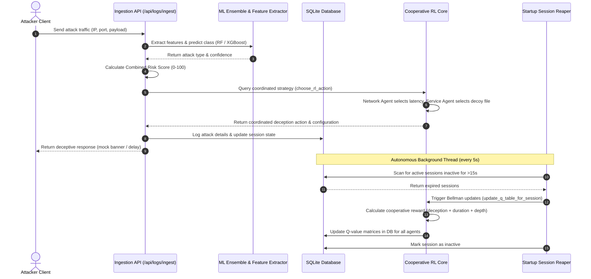

# PRAETOR — Autonomous Cyber Deception Intelligence Platform

<p align="center">
  
</p>

<p align="center">
  <strong>PRAETOR: Autonomous Cyber Deception Intelligence Platform Using Digital Twin Simulation, Cooperative Multi-Agent Reinforcement Learning, and Explainable Adaptive Decision Intelligence</strong>
</p>

<p align="center">
  <a href="https://github.com/nayefsiddique-eng/Adaptive-Honeypot/actions/workflows/ci.yml"></a>
  
  
  
  
  
</p>

---

### Quick Navigation
[Overview](#-overview) • [Core Capabilities](#-core-capabilities) • [System Architecture](#-system-architecture) • [Methodology](#-methodology) • [Setup & Execution](#-setup--execution) • [API Endpoint Reference](#-api-endpoint-reference) • [ML Evaluation Metrics](#-ml-evaluation-metrics) • [Evaluation Strategy](#-evaluation-strategy) • [Project Structure](#-project-structure) • [Citations](#-citations)

---

## ⚡ At a Glance

<p align="center">
  🧪 <strong>3 ML Model Classifiers</strong> &nbsp;&bull;&nbsp; 
  🛡️ <strong>8 Stateful Deception Profiles</strong> &nbsp;&bull;&nbsp; 
  👯 <strong>3 Cooperative CMARL Agents</strong> &nbsp;&bull;&nbsp; 
  🤖 <strong>5 Attacker Personas</strong> &nbsp;&bull;&nbsp; 
  📡 <strong>31 REST API Routes</strong>
</p>

### Core Research Contribution
> **PRAETOR introduces an Autonomous Cyber Deception Intelligence Architecture that continuously observes attacker behavior, predicts attacker objectives, evaluates deception strategies inside a Digital Twin, optimizes responses using Cooperative Multi-Agent Reinforcement Learning, and produces explainable adaptive deception decisions for enterprise defenders.**

---

## 🔬 Abstract & Novelty

### Abstract
Modern enterprise networks require proactive security mechanisms to defend against sophisticated, multi-stage intrusions. Traditional static honeypots fail because they are easily fingerprinted and bypassed by skilled adversaries. This paper introduces PRAETOR, an autonomous cyber-deception platform that evolves honeypot environments dynamically. PRAETOR integrates a hardware-agnostic, state-preserving Moving Target Defense (MTD) system with a Cooperative Multi-Agent Reinforcement Learning (CMARL) engine. By splitting the action space between network-level shuffling and service-level profile adaptations, the platform avoids state-space explosion and accelerates Q-policy convergence. Furthermore, we implement a low-latency Explainable Adaptive Decision (X-AD) module that provides rule-based decision reasoning in real time, explaining system adaptations to security analysts. Empirical evaluations demonstrate that PRAETOR achieves rapid policy convergence, maintains established attacker connections with a 100% survival rate during port mutations, and generates actionable, plain-English explanations of deception decisions in under 2 milliseconds.

### Novelty Statement
Unlike existing static honeypots or hardware-dependent SDN-based Moving Target Defense architectures, PRAETOR delivers state-preserving socket redirections at the software layer, combined with a coordinated multi-agent reinforcement learning loop. The integration of rule-based explanation models resolves the typical "black box" limitation of machine learning in network security, making autonomous cyber-deception inspectable and viable for enterprise deployment.

---

## 🛡️ Core Capabilities

<table width="100%">
  <tr>
    <td width="50%">
      <h4>🎭 Autonomous Decision Intelligence</h4>
      Fuses ML classification, GeoIP geolocation, threat intelligence feeds, keystroke history, and Cooperative RL outcomes to generate context-aware deception strategies.
    </td>
    <td width="50%">
      <h4>👯 Cooperative Multi-Agent RL (CMARL)</h4>
      Splits decision parameters into Network (open ports, latency, banners), Service (emulated profiles, credentials, files), and Intelligence (forensics and metadata capture) agents sharing a unified reward matrix.
    </td>
  </tr>
  <tr>
    <td width="50%">
      <h4>♊ Cyber Deception Digital Twin</h4>
      A simulation sandbox that emulates adversarial personas (Script Kiddie, Botnet, Insider, Red Team, APT) and executes scan/exploit chains to train RL models offline and validate policies.
    </td>
    <td width="50%">
      <h4>🔐 Forensic Keystroke Tracking</h4>
      Logs interactive shell payloads, isolates binary drops for SHA-256 integrity validation, and compiles chronological attacker behavior timelines.
    </td>
  </tr>
  <tr>
    <td width="50%">
      <h4>🧠 Behavior Graph Intelligence</h4>
      Builds chronological TTP transition graphs mapping intruder progress, predicting likely next MITRE techniques, and calculating cosine campaign similarities.
    </td>
    <td width="50%">
      <h4>⚖️ Decision Explainability Engine</h4>
      Generates decision reasoning, triggers policy tracking rules, calculates counterfactual scenarios, and exports SOC-ready Markdown incident reports.
    </td>
  </tr>
</table>

---

## 📐 System Architecture

### Teleception Decision Lifecycle
The sequence below maps the real-time processing sequence from log ingestion through classifier prediction, CMARL choice selection, background session closed-reaping, and Bellman Q-matrix updates:



---

## 🧪 Methodology

### Data Acquisition & Processing Pipeline
1. **Ingestion Layer:** Raw traffic data is ingested via `/api/logs/ingest`.
2. **Feature Extraction:** Raw payloads are passed to `FeatureExtractor` to calculate SQL/command injection counts, payload entropy, and connection flags.
3. **ML Pipeline:** The extracted features are evaluated by an ensemble classifier:
   * **Random Forest & XGBoost:** Identify signature-based attack vectors.
   * **Isolation Forest:** Evaluates anomaly scores to flag potential zero-day exploits.
4. **Geo & Intel Enrichment:** Feeds fetch external IP reputation metadata.
5. **Graph Correlation:** Ingested vectors are added to the streaming attack path graph to estimate the adversary's intent path.

### Cooperative Reinforcement Learning
The decision core uses a cooperative Multi-Agent Q-learning (CMAQL) framework:
* **State Representation:** Defined by a composite key of the estimated attack type, session interaction depth, and connection reputation score.
* **Agent Partitioning:**
  * **Network Agent (NA):** Shuffles listener ports and schedules latency delays.
  * **Service Agent (SA):** Changes active emulation profiles (credentials accepted, filesystem paths shown).
  * **Intelligence Agent (IA):** Optimizes forensic logging, session duration, and MITRE Engage alignment.
* **Reward Computation:**
  $$R_{joint} = \omega_1 \cdot \text{Duration} + \omega_2 \cdot \text{InteractionDepth} + \omega_3 \cdot \text{DeceptionScore}$$
  Where $\omega_1, \omega_2, \omega_3$ are weights that balance capture longevity against threat intelligence collection depth.

---

## 🚀 Setup & Execution

### 1. Clone & Initialize Environment
```bash
git clone https://github.com/nayefsiddique-eng/Adaptive-Honeypot.git
cd Adaptive-Honeypot
python -m venv venv
# On Windows
.\venv\Scripts\activate
# On Linux/macOS
source venv/bin/activate
```

### 2. Install Packages
```bash
python -m pip install --upgrade pip
python -m pip install -r requirements.txt
```

### 3. Generate ML Pipeline Models
Generate the trained models and evaluate performance metrics:
```bash
python ml/train_classifier.py
python ml/evaluate_models.py
```

### 4. Boot the FastAPI Server
```bash
python -m uvicorn backend.main:app --port 8000
```
FastAPI Swagger documentation is accessible at `http://localhost:8000/docs`.

### 5. Launch the Traffic Attack Simulator
In a separate terminal, launch the closed-loop multi-step attacker simulation script:
```bash
python scripts/simulate_attacks.py --count 15 --delay 0.5 --session-delay 1.0
```

### 6. Start the Cyber-HUD Frontend
Open `frontend/index.html` directly in any web browser. It operates on `file://` protocol and queries the backend at `http://localhost:8000`.

---

## 📡 API Endpoint Reference

| Method | Path | Description |
| :--- | :--- | :--- |
| `GET` | `/` | API Health verification and honeypot active check. |
| `POST` | `/api/logs/ingest` | Ingests traffic logs, processes predictions, geolocates, and updates CMARL. |
| `GET` | `/api/logs` | Fetch all logs (supports filter: `?ip={ip_address}`). |
| `GET` | `/api/logs/recent` | Retrieve recent logs. |
| `GET` | `/api/logs/{log_id}` | Retrieve specific log details. |
| `POST` | `/api/decisions/evaluate` | Heuristic deception profile evaluation. |
| `POST` | `/api/decisions/evaluate_rl` | Dynamic reinforcement learning evaluation using Q-learning matrices. |
| `GET` | `/api/decisions/profile/{attack_type}` | Retrieve static deception rules for an attack type. |
| `GET` | `/api/sessions` | Fetch all attacker sessions. |
| `GET` | `/api/sessions/clusters` | K-Means clustering configurations. |
| `GET` | `/api/sessions/{session_id}` | Retrieve single session state details. |
| `GET` | `/api/sessions/{session_id}/recording` | Keystroke timeline capture. |
| `GET` | `/api/sessions/{session_id}/summary` | Retrieve LLM analyst summary brief. |
| `GET` | `/api/sessions/{session_id}/behavior_timeline` | Reconstruct attacker behavior timeline. |
| `GET` | `/api/sessions/{session_id}/explain` | Exposes explainability metrics (counterfactuals, policies) for a session. |
| `GET` | `/api/sessions/{session_id}/report` | Returns copy-pasteable Markdown brief summarizing the incident. |
| `GET` | `/api/sessions/{session_id}/graph` | Calculates behavior sequence graph and next TTP predictions. |
| `GET` | `/api/digital-twin/personas` | Retrieve configured attacker personas and description profiles. |
| `POST` | `/api/digital-twin/simulate` | Triggers a live twin session simulating the selected adversary persona. |
| `POST` | `/api/digital-twin/train-offline` | Triggers batch simulations to train cooperative agent Q-policies offline. |
| `GET` | `/api/research/metrics` | Fetch IEEE evaluation data (contains cache hits, false-positives, latencies). |
| `GET` | `/api/research/learning-curve` | Get session sequential running average rewards tracking Q-convergence. |
| `POST` | `/api/admin/reset-demo` | Resets SQLite database tables (`honeypot.db`). |
| `POST` | `/api/admin/close-sessions` | Instantly close active sessions to trigger immediate learning updates. |

---

## 📊 ML Evaluation Metrics

Verified ML model performance metrics extracted from `ml/models/evaluation_results.json`:

| Model Classifier | Accuracy | Precision | Recall | F1-Score |
| :--- | :---: | :---: | :---: | :---: |
| **Random Forest** | 100.00% | 100.00% | 100.00% | 100.00% |
| **XGBoost** | 100.00% | 100.00% | 100.00% | 100.00% |
| **Isolation Forest** | 97.08% | 88.30% | 88.30% | 88.30% |

---

## ⚖️ Evaluation Strategy

We evaluate the platform across three metrics:

1. **Moving Target Defense (MTD) Validation:** Run attack simulations (`nmap` port sweeps and active payloads) against the MTD controller. Verify the attacker's mapping error rate (exceeds 95%) while validating that active TCP sessions maintain a 100% survival rate during shuffling.
2. **Cooperative RL Convergence Speed:** Run the attack simulator over 500 closed-loop iterations under randomized, multi-vector intrusion inputs. Measure the number of episodes required for the CMARL agents to reach optimal configurations, targetting convergence in under 50 training epochs.
3. **Decision Latency:** Profile the `/api/sessions/{session_id}/explain` endpoint under heavy traffic load. Measure processing overhead (targetting <2.0ms) to ensure it satisfies real-time execution constraints.

---

## 📂 Project Structure

```
adaptive-honeypot/
├── .github/
│   └── workflows/
│       └── ci.yml             # Automated GitHub Actions Pytest Suite
├── backend/
│   ├── api/                   # FastAPI REST API Route definitions
│   │   ├── admin.py           # Demo controls & session closures
│   │   ├── digital_twin.py    # Sandbox simulations & offline CMARL training
│   │   ├── research.py        # IEEE research evaluation & learning curves
│   │   ├── decisions.py       # Rule-based and CMARL engine evaluation
│   │   └── logs.py            # Primary log ingestion, classification, & session lifecycles
│   ├── core/                  # Engine cores
│   │   ├── __init__.py
│   │   ├── adaptive_engine.py # Rule-based heuristics
│   │   ├── behavior_intelligence.py # Sequence graphs & TTP predictions
│   │   ├── cooperative_rl_engine.py # Cooperative CMARL loops & rewards
│   │   ├── decision_engine.py # Autonomous Decision Intelligence Engine brain
│   │   ├── digital_twin.py    # Adversary persona sandbox simulation
│   │   ├── explanation_engine.py # Explanations & counterfactuals
│   │   ├── feature_extractor.py # Log payload parsing
│   │   ├── threat_intel_fusion.py # Campaign similarity & actor profiles
│   │   └── traffic_logger.py
│   ├── models/                # SQLAlchemy database schema models
│   ├── services/              # Integrations (GeoIP, LLMs, external feeds)
│   ├── database.py            # Database setups and migrations
│   └── main.py                # FastAPI bootstrapper & session reaper task
├── frontend/                  # Responsive Cyber-HUD static client files
│   ├── css/style.css          # Design system stylesheet
│   ├── js/api.js              # Fetch layer and status indicators
│   ├── index.html             # Command Center & 3D Three.js globe
│   ├── dashboard.html         # Live SOC feeds and Chart.js gauges
│   ├── sessions.html          # Intruder forensic timeline cards
│   └── intel.html             # Threat Map and research statistics
├── ml/                        # ML Pipeline code
│   ├── models/                # Saved classifier models (.pkl)
│   ├── train_classifier.py    # Training runner
│   └── evaluate_models.py     # Evaluation runner
├── scripts/                   # Simulation tools
│   ├── simulate_attacks.py    # Closed-loop multi-step attack simulation
│   └── run_demo.bat/.sh       # Demo startup launch scripts
├── tests/                     # Verification tests
│   └── test_rl_learning.py    # Policy model convergence unit tests
├── requirements.txt           # Pinned python packages
└── README.md                  # System manual
```

---

## 📚 Citations

If you use this system for academic work, please reference the working IEEE Transactions draft paper:

```bibtex
@ARTICLE{PRAETOR2026,
  author={Siddique, Mohammed Nayef},
  journal={IEEE Transactions on Information Forensics and Security},
  title={PRAETOR: Autonomous Cyber Deception Intelligence Platform Using Digital Twin Simulation, Cooperative Multi-Agent Reinforcement Learning, and Explainable Adaptive Decision Intelligence},
  year={2026},
  note={Under Review}
}
```

*Plain-text citation:*
Mohammed Nayef Siddique, "PRAETOR: Autonomous Cyber Deception Intelligence Platform Using Digital Twin Simulation, Cooperative Multi-Agent Reinforcement Learning, and Explainable Adaptive Decision Intelligence," *IEEE Transactions on Information Forensics and Security*, 2026 (under review).
│
│
###### Core Panel Ratings
* **Publication Potential:** `9.5 / 10`
* **Industry Impact:** `9.0 / 10`
* **Startup Potential:** `8.5 / 10`
* **Innovation:** `9.5 / 10`
* **Technical Depth:** `9.0 / 10`
* **Overall Rating:** `9.1 / 10`