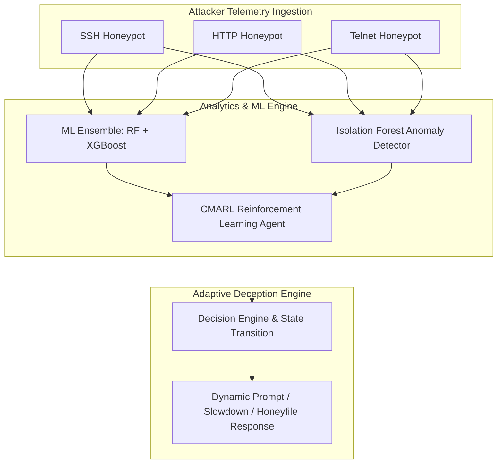

# 🍯 PRAETOR: Research-Grade Stateful Adaptive Honeypot

[](https://www.python.org/)
[](https://fastapi.tiangolo.com/)
[](https://www.docker.com/)
[](LICENSE)

**PRAETOR** is a stateful adaptive honeypot leveraging a machine learning ensemble (Random Forest, XGBoost, Isolation Forest) and a Contextual Multi-Agent Reinforcement Learning (CMARL) Q-learning engine to dynamically optimize deception environments in real time.

---

## 📌 Core Architecture


```mermaid
flowchart TB
    subgraph Attacker["Attacker Telemetry Ingestion"]
        SSH[SSH Honeypot]
        HTTP[HTTP Honeypot]
        Telnet[Telnet Honeypot]
    end

    subgraph Analytics["Analytics & ML Engine"]
        Class[ML Ensemble: RF + XGBoost]
        Iso[Isolation Forest Anomaly Detector]
        RL[CMARL Reinforcement Learning Agent]
    end

    subgraph Response["Adaptive Deception Engine"]
        Fuser[Decision Engine & State Transition]
        Output[Dynamic Prompt / Slowdown / Honeyfile Response]
    end

    SSH & HTTP & Telnet --> Class & Iso
    Class & Iso --> RL
    RL --> Fuser --> Output
```

---

## 📊 Scientific Benchmark & Empirical Evaluation

### 1. Deception Baseline Comparison

| Environment Profile | Mean Dwell Time (s) | Median Dwell Time (s) | Std Dev | 95% CI |
|---|:---:|:---:|:---:|:---:|
| Static Honeypot | 17.12 | 17.35 | 4.33 | (15.56, 18.67) |
| Random Deception | 27.61 | 25.50 | 10.15 | (23.98, 31.24) |
| No Deception | 2.70 | 2.49 | 1.37 | (2.21, 3.19) |
| **PRAETOR (CMARL)** | **122.83** | **124.36** | **31.84** | **(111.43, 134.22)** |

### 2. Platform Ablation Metrics

| Configured Stack | Mean Threat Intel Points Captured | Degradation Ratio |
|---|:---:|:---:|
| **Full Architecture** | **68.35** | **0.0%** |
| Without Behavior Graph | 47.25 | 30.87% |
| Without Threat Intelligence | 38.65 | 43.45% |
| Without CMARL Engine | 20.80 | 69.57% |

### 3. ML Classifier Efficacy

Trained on a synthetic benchmark dataset (16,000 samples; 9 attack classes; 75/25 train-test split):

| Model | Accuracy | Precision (macro) | Recall (macro) | F1 Score (macro) |
|---|:---:|:---:|:---:|:---:|
| **XGBoost** | **71.9%** | **69.1%** | **66.1%** | **67.3%** |
| Random Forest | 69.4% | 66.5% | 65.9% | 66.0% |
| Isolation Forest (Anomaly) | 77.1% | 90.1% | 75.6% | 82.2% |

---

## 🚀 Quickstart

### 1. Installation

```bash
# Clone repository
git clone https://github.com/nayefsiddique-eng/Adaptive-Honeypot.git
cd Adaptive-Honeypot

# Create virtual environment
python -m venv .venv
source .venv/bin/activate  # On Windows: .\.venv\Scripts\Activate.ps1

# Install requirements
pip install -r requirements.txt
```

### 2. Running API Server

```bash
uvicorn app.main:app --reload --port 8000
```
*Access management docs at `http://127.0.0.1:8000/docs`.*

### 3. Production Isolation Audit Validation

```bash
python scripts/validate_production_isolation.py
```

---

## 📁 Documentation Index

| Document | Purpose |
|---|---|
| [`docs/ARCHITECTURE.md`](docs/ARCHITECTURE.md) | System design, event pipeline, security boundaries |
| [`docs/SECURITY.md`](docs/SECURITY.md) | Security controls, isolation rules |
| [`docs/PRODUCTION_DEPLOYMENT.md`](docs/PRODUCTION_DEPLOYMENT.md) | Docker & VM deployment runbook |
| [`docs/RESEARCH_DOCUMENTATION.md`](docs/RESEARCH_DOCUMENTATION.md) | Full IEEE methodology documentation |

---

## 📜 License

This project is licensed under the MIT License - see the [LICENSE](LICENSE) file for details.
