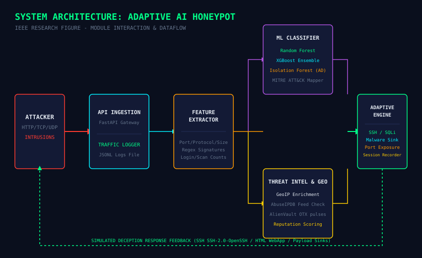
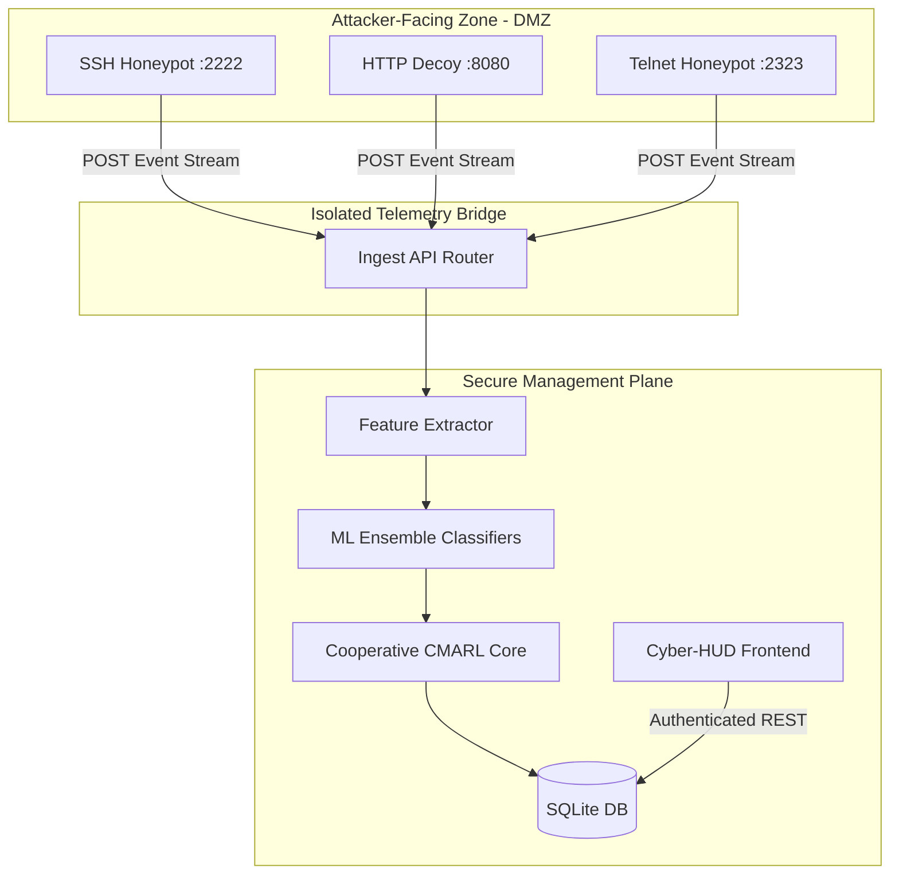

# PRAETOR — Adaptive Cyber Deception Platform

> **Autonomous honeypot system combining multi-protocol deception, real-time ML classification, and Cooperative Multi-Agent Reinforcement Learning (CMARL) to engage, fingerprint, and adapt to active threat actors.**

[](https://github.com/nayefsiddique-eng/Adaptive-Honeypot/actions/workflows/ci.yml)


---

## Overview

PRAETOR is a research honeypot platform built around one idea: static honeypots lose once an attacker fingerprints them. PRAETOR responds by dynamically mutating its deception profile — the emulated services, credentials, file systems, and network timing — based on what the attacker is doing.

Three real honeypot listeners (SSH, HTTP, Telnet) capture attacker traffic and forward telemetry to a secure management backend. The backend classifies the attack type using an ML ensemble, calculates a risk score, and consults three cooperative RL agents (Network, Service, Intelligence) that jointly select the next deception action. Session history, reward signals, and Q-value matrices are persisted and updated on every session close.

The system is designed to be run in a two-VM or two-container topology: one untrusted node running the honeypots, one trusted node running the management stack.

---

## Architecture

PRAETOR employs a modular, decoupled system architecture designed to isolate public-facing honeypot listeners from secure analytics and management routines.

<p align="center">
  
</p>

### Component Organization


```mermaid
graph TD
    subgraph DMZ [Attacker-Facing Zone - DMZ]
        SSH[SSH Honeypot :2222]
        HTTP[HTTP Decoy :8080]
        TEL[Telnet Honeypot :2323]
    end

    subgraph Telemetry [Isolated Telemetry Bridge]
        ING[Ingest API Router]
    end

    subgraph Management [Secure Management Plane]
        FE[Feature Extractor]
        ML[ML Ensemble Classifiers]
        RL[Cooperative CMARL Core]
        DB[(SQLite DB)]
        HUD[Cyber-HUD Frontend]
    end

    SSH & HTTP & TEL -->|POST Event Stream| ING
    ING --> FE
    FE --> ML
    ML --> RL
    RL --> DB
    HUD -->|Authenticated REST| DB
```

---

## Key Capabilities

| Capability | Detail |
|---|---|
| **SSH Honeypot** | Real `asyncssh` server; interactive shell with stateful per-session virtual filesystem; keystroke recording; credential bait |
| **HTTP Decoy** | Real `aiohttp` server; exposed env vars, config files, login pages, download vectors; path-based scanner engagement |
| **Telnet Honeypot** | `asyncio` shell emulator for legacy/embedded device fingerprinting |
| **Stateful Virtual Filesystem** | Per-session in-memory Linux FS that persists across commands within a session; path traversal guards |
| **ML Attack Classification** | Random Forest + XGBoost ensemble for multi-class attack-type prediction; Isolation Forest for anomaly/zero-day flagging |
| **Risk Scoring** | 0–100 composite score fusing attack type confidence, session depth, payload entropy, and geolocation |
| **Cooperative CMARL** | Three Q-learning agents (Network, Service, Intelligence) sharing a joint reward signal; Bellman updates on session close |
| **Adaptive Deception Profiles** | 8 profiles (APT, brute-force, scanner, etc.) dynamically selected by the RL engine |
| **Forensic Telemetry** | SHA-256 payload hashing; chronological TTP timelines; MITRE Engage mapping |
| **Session Reaper** | Background thread (5 s interval) closes stale sessions and triggers Q-value updates |
| **Management API** | 30+ authenticated REST endpoints for logs, sessions, decisions, research metrics, and admin controls |
| **Cyber-HUD Dashboard** | Single-page frontend with live attack map, classifier gauges, RL learning curve |
| **Production Isolation** | Three-plane Docker network; read-only container FS; non-root user; all capabilities dropped |

---

## Deception Flow

```
  Attacker interacts with honeypot
          │
          ▼
  Honeypot records event metadata
          │
          ▼
  POST /api/logs/ingest  (unauthenticated, internal only)
          │
          ▼
  Feature Extraction  ──►  ML Classification  ──►  Risk Score
          │
          ▼
  CMARL: 3 agents select coordinated deception action
    ├── Network Agent  →  latency / port / banner
    ├── Service Agent  →  emulation profile / bait files
    └── Intel Agent    →  forensic depth / capture duration
          │
          ▼
  Honeypot adapts response to attacker
          │
          ▼
  Session close  →  Reward calculated  →  Q-values updated in DB
          │
          ▼
  Dashboard / Research metrics refreshed
```

---

## Security Architecture

PRAETOR implements a layered control model separating what the attacker sees from what the analyst controls.

### Network Planes (Production)

| Plane | Purpose | Binding |
|---|---|---|
| `attacker_net` | Honeypot listeners face the internet | Public / DMZ |
| `telemetry_net` | Honeypots POST events inward | Internal bridge only |
| `management_net` | Dashboard, DB, ML/RL stack | Localhost / private |

### Implemented Controls

| Control | Implementation |
|---|---|
| Management authentication | `X-Management-Key` header; `hmac.compare_digest` constant-time comparison |
| Admin authentication | `X-Admin-Key` header; separate from management key |
| Rate limiting | Per-IP token bucket; 60 req / 60 s (configurable) |
| Request size cap | 1 MB max POST body; HTTP 413 on violation |
| Security headers | `X-Content-Type-Options`, `X-Frame-Options`, `Referrer-Policy`, `Cache-Control: no-store` |
| Exception sanitisation | Stack traces logged server-side only; generic messages returned to clients |
| Log rotation | `RotatingFileHandler`; 10 MB max, 5 backups |
| Command length enforcement | SSH/Telnet commands > 8 192 bytes rejected as `oversized_command` |
| Path traversal guards | `C:\`, `D:\`, `\\server`, `%VAR%`, null bytes blocked before FS resolution |
| Docker hardening | Non-root `praetor` user; `read_only: true`; `cap_drop: [ALL]`; `no-new-privileges: true`; no host socket mount |
| Production fail-closed | Application refuses to start if default secrets are set when `ENVIRONMENT=production` |

### Intentionally Open Endpoints

```
POST /api/logs/ingest   # honeypot sensors call this; no auth by design
GET  /health            # operational monitoring
GET  /                  # frontend entry point
```

---

## Project Structure

```
adaptive-honeypot/
├── .github/
│   └── workflows/ci.yml          # GitHub Actions — pytest on every push
├── backend/
│   ├── api/                      # FastAPI route handlers (16 modules)
│   │   ├── logs.py               # Ingest, ML classification, session tracking
│   │   ├── sessions.py           # Forensic replay, keystroke timeline, LLM brief
│   │   ├── decisions.py          # Rule-based and CMARL evaluation
│   │   ├── research.py           # IEEE evaluation data and learning curves
│   │   ├── admin.py              # Destructive resets (X-Admin-Key required)
│   │   └── ...                   # dashboard, geoip, threat_intel, timeline, etc.
│   ├── core/                     # Engine internals (16 modules)
│   │   ├── cooperative_rl_engine.py   # CMARL Q-learning loop and reward
│   │   ├── feature_extractor.py       # Payload parsing and feature engineering
│   │   ├── decision_engine.py         # Heuristic deception rule engine
│   │   ├── behavior_intelligence.py   # TTP sequence graph and MITRE mapping
│   │   ├── explanation_engine.py      # Plain-English decision explanations
│   │   └── ...
│   ├── honeypot/
│   │   ├── ssh_server.py         # asyncssh SSH honeypot
│   │   ├── http_decoy.py         # aiohttp HTTP decoy
│   │   ├── telnet_server.py      # asyncio Telnet honeypot
│   │   └── fake_filesystem.py    # Stateful per-session virtual Linux FS
│   ├── middleware/
│   │   └── security.py           # Rate limiter, size limits, security headers
│   ├── models/                   # SQLAlchemy ORM models
│   ├── services/
│   │   └── classifier.py         # ML model loader with graceful heuristic fallback
│   ├── config.py                 # Pydantic settings with production validation
│   ├── database.py               # DB init and schema migration
│   └── main.py                   # FastAPI app, middleware stack, session reaper
├── conftest.py                   # Pytest startup warning filters
├── docs/
│   ├── ARCHITECTURE.md           # Component design and event flow
│   ├── SECURITY.md               # Trust boundaries and hardening guide
│   ├── PRODUCTION_DEPLOYMENT.md  # Docker / VM deployment runbook
│   ├── RELATED_WORK.md           # Prior work comparison table
│   ├── RESEARCH_DOCUMENTATION.md # Full methodology documentation
│   ├── BENCHMARK_REPORT.md       # Benchmark design and results
│   ├── ARTIFACT_EVALUATION.md    # Reproducibility guide for evaluators
│   └── THREAT_MODEL.md           # Attacker capability assumptions
├── docker-compose.prod.yml       # Three-plane production network layout
├── docker-compose.yml            # Single-host development layout
├── Dockerfile                    # Hardened build: non-root, SSH key pre-gen
├── frontend/
│   ├── index.html                # Cyber-HUD command centre
│   └── ...                       # CSS, JS
├── ml/
│   ├── train_classifier.py       # Trains RF, XGBoost, Isolation Forest
│   ├── evaluate_models.py        # Produces evaluation_results.json
│   └── models/                   # Generated model files (gitignored)
├── scripts/
│   ├── run_honeypots.py          # Starts all three honeypot listeners
│   ├── simulate_attacks.py       # Synthetic attack replay for local testing
│   ├── validate_production_isolation.py  # 13-check Docker config auditor
│   └── generate_validation_data.py       # Regenerates validation/ artifacts
├── tests/
│   ├── test_honeypot_enhancements.py  # 10 honeypot behaviour tests
│   ├── test_rl_learning.py            # 3 CMARL convergence and regression tests
│   └── test_security_hardening.py     # 6 security regression tests
├── validation/                   # Reproducible evidence package
├── .env.example                  # Configuration template (no real secrets)
├── pyproject.toml                # Project metadata and pytest config
└── requirements.txt              # Pinned dependencies
```

---

## Requirements

- Python 3.12 or later (tested on 3.14.5)
- `pip` and `venv`
- SQLite (bundled with Python — no separate install needed)
- Windows PowerShell or Linux/macOS shell

---

## Local Development

All commands assume a Windows PowerShell prompt at the repository root.

**1. Create and activate a virtual environment**
```powershell
python -m venv venv
.\venv\Scripts\Activate.ps1
```

**2. Install dependencies**
```powershell
pip install -e .
```

**3. Configure environment**
```powershell
Copy-Item .env.example .env
# Edit .env and set SECRET_KEY, ADMIN_API_KEY, MANAGEMENT_API_KEY
```

**4. Train ML models** *(optional — falls back to heuristic-only mode if skipped)*
```powershell
python ml/train_classifier.py
```

**5. Start the management backend**
```powershell
python -m uvicorn backend.main:app --host 127.0.0.1 --port 8000
```

**6. Start honeypot listeners** *(separate shell)*
```powershell
$env:PYTHONPATH = "."
python scripts/run_honeypots.py
```

---

## Access Points

| Service | Address | Notes |
|---|---|---|
| Management API | `http://127.0.0.1:8000` | Localhost only |
| Swagger Docs | `http://127.0.0.1:8000/docs` | Management routes require auth header |
| Health Check | `http://127.0.0.1:8000/health` | Public |
| Cyber-HUD | `http://127.0.0.1:8000/` | Served by FastAPI static files |
| SSH Honeypot | `127.0.0.1:2222` | Attack-facing — loopback in dev |
| HTTP Decoy | `127.0.0.1:8080` | Attack-facing — loopback in dev |
| Telnet Honeypot | `127.0.0.1:2323` | Attack-facing — loopback in dev |

*In production, honeypot ports are exposed on a DMZ interface. The management API remains private.*

---

## Configuration Reference

All settings are loaded from `.env` (see `.env.example`). Variables not set fall back to the defaults shown.

| Variable | Default | Description |
|---|---|---|
| `ENVIRONMENT` | `development` | Set to `production` to enable fail-closed secret validation |
| `API_HOST` | `127.0.0.1` | FastAPI bind address — **never `0.0.0.0` in production** |
| `API_PORT` | `8000` | FastAPI bind port |
| `SECRET_KEY` | `changeme-in-production` | App secret — **must change for production** |
| `ADMIN_API_KEY` | `changeme-admin-key` | `X-Admin-Key` header value |
| `MANAGEMENT_API_KEY` | `changeme-management-key` | `X-Management-Key` header value |
| `DATABASE_URL` | `sqlite:///./honeypot.db` | SQLite path (WAL mode) |
| `MAX_REQUEST_BODY_BYTES` | `1048576` | 1 MB POST cap |
| `MAX_COMMAND_LENGTH` | `8192` | SSH/Telnet command length before rejection |
| `API_RATE_LIMIT` | `60` | Requests per IP per window |
| `API_RATE_WINDOW_SECONDS` | `60` | Rate limit window |
| `LOG_MAX_BYTES` | `10485760` | Log file size before rotation (10 MB) |
| `LOG_BACKUP_COUNT` | `5` | Rotated log files to keep |

> When `ENVIRONMENT=production`, the application **refuses to start** if any of `SECRET_KEY`, `ADMIN_API_KEY`, or `MANAGEMENT_API_KEY` still hold their default placeholder values.

---

## Production Deployment

See [`docs/PRODUCTION_DEPLOYMENT.md`](docs/PRODUCTION_DEPLOYMENT.md) for the full runbook.

The production `docker-compose.prod.yml` runs two containers on three isolated Docker networks:

- **`praetor-honeypot`** — Serves SSH / HTTP / Telnet. Runs with `read_only: true`, all Linux capabilities dropped, `no-new-privileges: true`, tmpfs for `/tmp` and `/run`. No access to management network.
- **`praetor-management`** — Runs FastAPI + ML/RL stack. Binds to `127.0.0.1:8000` only. Has access to the telemetry bridge to receive ingest events from the honeypot.

```powershell
# Start production stack
docker compose -f docker-compose.prod.yml --env-file .env.management up -d

# Validate the isolation configuration before deployment
python scripts/validate_production_isolation.py
```

---

## Security

See [`docs/SECURITY.md`](docs/SECURITY.md) for the full threat model, trust boundary diagrams, and hardening checklist.

To report a vulnerability, open a private GitHub Security Advisory.

---

## Testing

```powershell
# Full suite
python -m pytest tests/ -v

# With warnings promoted to errors (zero-warning target)
python -m pytest -W error
```

**Verified test results** (Python 3.14.5, pytest 9.1.1):

```
tests/test_honeypot_enhancements.py  10 passed
tests/test_rl_learning.py             3 passed
tests/test_security_hardening.py      6 passed
─────────────────────────────────────────────
TOTAL                                19 passed   0 failed   0 warnings
```

**What the tests cover:**

| File | Tests |
|---|---|
| `test_honeypot_enhancements.py` | Stateful filesystem ops; path traversal isolation; fingerprinting detection; download attempt tracking; fake OS consistency; reward bounds; schema migration; command injection safety; HTTP suspicious path routing; deception transition telemetry |
| `test_rl_learning.py` | CMARL Q-policy convergence (250 cycles); action key schema; action variation regression |
| `test_security_hardening.py` | Path traversal guards; command length enforcement; unauthenticated management access rejection; invalid API key rejection; ingest open access; CORS management origins |

---

## Production Isolation Validation

```powershell
python scripts/validate_production_isolation.py
```

Audits `docker-compose.prod.yml` and `.env.honeypot` against 13 isolation requirements:

```
PASS: Host networking is disabled
PASS: Privileged container mode disabled
PASS: Docker socket is not mounted
PASS: Network 'attacker_net' is defined
PASS: Network 'telemetry_net' is defined
PASS: Network 'management_net' is defined
PASS: Honeypot is isolated from management_net
PASS: Management API is private or bound only to localhost interface
PASS: no-new-privileges is configured
PASS: cap_drop ALL is configured
PASS: Container filesystem is read-only
PASS: Production resource limits are set
PASS: Honeypot configuration is free of management secrets
```

---

## ML Classifier Performance

Models are trained on a synthetic benchmark dataset (16 000 samples; 9 attack classes; 75 / 25 train–test split; held-out stratified evaluation). Source: `ml/models/evaluation_results.json`.

### Multi-Class Classifier (9 attack types)

| Model | Accuracy | Precision (macro) | Recall (macro) | F1 (macro) |
|---|:---:|:---:|:---:|:---:|
| **XGBoost** | 71.9% | 69.1% | 66.1% | 67.3% |
| **Random Forest** | 69.4% | 66.5% | 65.9% | 66.0% |

**Per-class breakdown (XGBoost):**

| Attack Class | Precision | Recall | F1 |
|---|:---:|:---:|:---:|
| benign | 73.9% | 88.5% | 80.6% |
| brute_force | 86.9% | 87.8% | 87.4% |
| command_injection | 69.5% | 65.8% | 67.6% |
| malware_delivery | 64.4% | 60.0% | 62.1% |
| path_traversal | 72.1% | 63.9% | 67.8% |
| port_scan | 82.9% | 85.8% | 84.4% |
| sql_injection | 50.0% | 42.9% | 46.2% |
| unknown | 73.0% | 66.3% | 69.5% |
| xss | 49.1% | 34.2% | 40.3% |

### Anomaly Detector (Isolation Forest — binary: benign vs. attack)

| Metric | Value |
|---|:---:|
| Accuracy | 77.1% |
| Precision | 90.1% |
| Recall | 75.6% |
| F1 | 82.2% |

To regenerate models and metrics:
```powershell
python ml/train_classifier.py
python ml/evaluate_models.py
```

---

## API Reference

### Public (no authentication)

| Method | Path | Description |
|---|---|---|
| `GET` | `/` | Frontend entry / API active check |
| `GET` | `/health` | Subsystem status (API, DB, ML, RL, SSH, HTTP, Telnet) |
| `POST` | `/api/logs/ingest` | Honeypot telemetry ingest; runs ML and updates CMARL |

### Management (require `X-Management-Key` header)

| Method | Path | Description |
|---|---|---|
| `GET` | `/api/logs` | Fetch all logs (supports `?ip=` filter) |
| `GET` | `/api/logs/recent` | Recent logs (max 100) |
| `GET` | `/api/sessions` | All attacker sessions |
| `GET` | `/api/sessions/{id}` | Single session state |
| `GET` | `/api/sessions/{id}/transitions` | Deception state transitions and step rewards |
| `GET` | `/api/sessions/{id}/recording` | Keystroke timeline |
| `GET` | `/api/sessions/{id}/explain` | Explainability metrics and counterfactuals |
| `GET` | `/api/sessions/{id}/report` | Markdown incident brief |
| `GET` | `/api/sessions/{id}/graph` | TTP behaviour graph |
| `POST` | `/api/decisions/evaluate` | Heuristic deception profile evaluation |
| `POST` | `/api/decisions/evaluate_rl` | RL Q-policy evaluation |
| `GET` | `/api/dashboard` | Aggregated KPI metrics |
| `GET` | `/api/timeline` | Hourly and daily attack timeline |
| `GET` | `/api/attacks/summary` | Attack type and MITRE aggregations |
| `GET` | `/api/research/metrics` | IEEE evaluation data |
| `GET` | `/api/research/learning-curve` | Q-convergence reward curve |
| `POST` | `/api/digital-twin/simulate` | Run adversary persona simulation |
| `POST` | `/api/digital-twin/train-offline` | Batch offline CMARL training |
| `GET` | `/api/geoip/attack-map` | Geolocation data for attack map |
| `GET` | `/api/threat-intel/{ip}` | Local and external intel for an IP |
| `POST` | `/api/demo/start` | Trigger 15-event multi-stage attack playbook |

### Admin (require `X-Admin-Key` header)

| Method | Path | Description |
|---|---|---|
| `POST` | `/api/admin/reset-demo` | Wipe all database tables |
| `POST` | `/api/admin/close-sessions` | Force-close all active sessions to trigger RL updates |
| `POST` | `/api/admin/guided-demo` | Run automated guided demo scenario |

---

## Limitations

- **Synthetic training data:** ML classifiers are trained on generated data. Real-world accuracy will vary depending on traffic distribution.
- **No live threat feeds by default:** GeoIP and threat-intel enrichment require optional external API keys (`GEOIP_DB_PATH`, feed credentials).
- **Infrastructure dependency:** Production security depends on surrounding network controls (VLANs, firewall rules, ingress restrictions). The application alone does not substitute for infrastructure isolation.
- **VM or container isolation required:** Compromising a honeypot endpoint must not expose the management host. This requires correct deployment topology — it is not automatic.
- **Intentional vulnerabilities:** The honeypots are designed to appear exploitable. Misconfiguring the deployment boundary could expose real infrastructure.
- **No absolute security guarantee:** PRAETOR is a research platform. It should only be deployed in designated, isolated research or test environments with explicit authorisation.

---

## Documentation Index

| Document | Purpose |
|---|---|
| [`docs/ARCHITECTURE.md`](docs/ARCHITECTURE.md) | Component design, event flow, security boundaries |
| [`docs/SECURITY.md`](docs/SECURITY.md) | Trust model, credential separation, hardening controls |
| [`docs/PRODUCTION_DEPLOYMENT.md`](docs/PRODUCTION_DEPLOYMENT.md) | Docker and VM deployment runbook |
| [`docs/THREAT_MODEL.md`](docs/THREAT_MODEL.md) | Attacker capability assumptions |
| [`docs/RELATED_WORK.md`](docs/RELATED_WORK.md) | Comparison with prior honeypot systems |
| [`docs/RESEARCH_DOCUMENTATION.md`](docs/RESEARCH_DOCUMENTATION.md) | Full IEEE methodology documentation |
| [`docs/BENCHMARK_REPORT.md`](docs/BENCHMARK_REPORT.md) | Benchmark design and empirical results |
| [`docs/ARTIFACT_EVALUATION.md`](docs/ARTIFACT_EVALUATION.md) | Reproducibility guide for evaluators |

---

## License

MIT — see [`LICENSE`](LICENSE) for full terms.

---

## Disclaimer

PRAETOR is intended exclusively for authorised defensive security research, controlled educational environments, and threat-intelligence collection within explicitly isolated infrastructure. Do not deploy this software on networks you do not own or have written authorisation to test. The honeypot services are designed to appear vulnerable — inappropriate deployment exposes real infrastructure to risk.