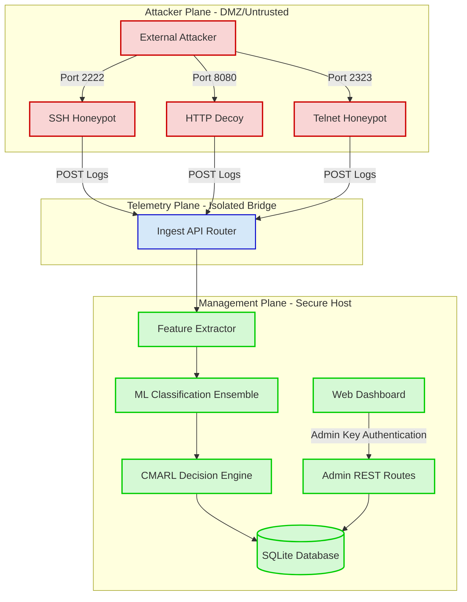

# System Architecture Reference

This document provides a detailed overview of PRAETOR's technical architecture, component breakdown, data flow, and security boundary controls.

---

## 🏛️ Component Overview

PRAETOR is structured around a three-plane architectural model that isolates untrusted execution components from secure analytics and administrative controls.

---

## 🛰️ Architecture Planes

### 1. Attacker Plane (DMZ / Untrusted)
* **SSH Honeypot (`backend/honeypot/ssh_server.py`):** Multi-stage shell emulator simulating a low-privilege environment with mock interactive commands, keystroke tracking, and state-preserving session progression.
* **HTTP Decoy (`backend/honeypot/http_decoy.py`):** Mock web server presenting realistic vulnerability signatures (e.g., exposed environment variables, file download paths, and administrative login pages) designed to engage automated scanners.
* **Telnet Honeypot (`backend/honeypot/telnet_server.py`):** Emulates vulnerable legacy industrial/networking interfaces with interactive shell capabilities.

### 2. Telemetry Plane (Isolated Bridge)
* **Ingest API Routing (`backend/api/logs.py`):** Acts as a strict unidirectional egress gateway from the honeypots. Honeypot sensors forward security event streams using HTTP POST calls to `/api/logs/ingest`.
* **Rate-limiting and Payload Checks:** Telemetry inputs are strictly verified. Payloads are restricted to 1MB, and rate-limits prevent log-injection or Denial-of-Service (DoS) attacks on the management interface.

### 3. Management Plane (Secure Host)
* **Core Application API (`backend/main.py`):** Exposes management, intelligence, operations, and dashboard routes. Secure endpoints require the `X-Management-Key` or `X-Admin-Key` headers.
* **Feature Extraction Engine:** Parses raw attacker commands, flags, and payloads into threat intelligence features.
* **ML Ensemble Classifier:** Fuses XGBoost, Random Forest, and Isolation Forest models to classify attacker personas and flag anomalies or zero-day behavior.
* **Cooperative CMARL Engine:** Coordinates Network, Service, and Intelligence Q-learning agents to dynamically adjust honeypot parameters (deception profiles, latency delays, ports) while maintaining session persistence.
* **SQLite Database (`honeypot.db`):** Holds session states, telemetry event logs, active deception profiles, and agent Q-values.

---

## 🔄 End-to-End Deception Flow

1. **Traffic Ingestion:** The attacker interacts with one of the honeypots (e.g., executing a command via SSH).
2. **Telemetry Dispatch:** The honeypot logs the metadata and sends an unauthenticated JSON log stream to `/api/logs/ingest`.
3. **Feature Extraction & Risk Classification:** The backend extracts connection flags, command patterns, and payload entropy. It passes these features to the ML classifier to predict the attacker type (Script Kiddie, Botnet, APT, etc.) and calculate a risk score (0-100).
4. **Cooperative Strategy Selection:** The CMARL decision engine checks the current Q-policy matrix and selects a coordinated action across the Network (port state, delay), Service (emulated filesystem, bait credentials), and Intel planes.
5. **Adaptive Action execution:** The honeypot profile changes dynamically. The response is returned to the attacker (e.g., mock command output or delayed connection).
6. **Reward and Policy Optimization:** Upon session teardown or timeout, a background thread calculates the cumulative session reward (duration, command depth, deception score) and triggers Bellman Q-value updates for all cooperative agents in the database.
