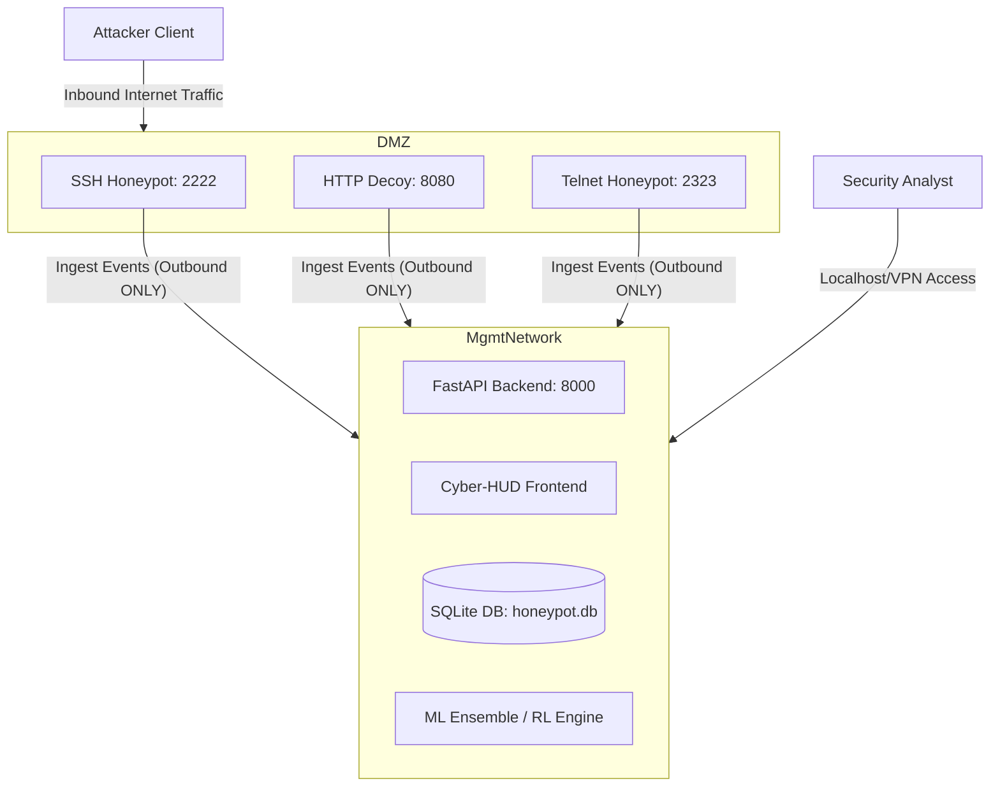

# PRAETOR Security Architecture and Production Deployment Guide

This document describes the security trust boundaries, network topologies, privilege segregation, and hardening requirements for running the PRAETOR / Adaptive-Honeypot platform in production-grade environments.

---

## 🛡️ Trust Boundaries and Threat Model

PRAETOR operates two highly distinct environments with completely opposing trust profiles. These environments **must never** be co-located in the same network context or run with shared system privileges.

### 1. Attacker-Facing Zone (Untrusted)
- **Services**: SSH (Port 2222), HTTP Decoy (Port 8080), Telnet (Port 2323).
- **Profile**: Completely untrusted. Subject to arbitrary command execution, exploit payloads, brute force attempts, and scanner discovery.
- **Requirement**: Must be deployed in an isolated VM, DMZ network segment, or separate container network.

### 2. Management Zone (Trusted)
- **Services**: FastAPI Backend (Port 8000), Cyber-HUD Dashboard, SQLite database (`honeypot.db`), ML/RL engines, AI summarizers.
- **Profile**: Trusted. Exposes administrative controls, session forensics, system-wide metrics, and databases.
- **Requirement**: Must bind only to loopback (`127.0.0.1`) by default, protected by firewall rules, and only accessed locally or via a secure VPN.

---

## 🌐 Outbound Network Policy

The application must follow a strict outbound network allowlist:

| Zone/Service | Outbound Target | Rationale | Policy |
| :--- | :--- | :--- | :--- |
| **Honeypot Listeners** | Management API `/api/logs/ingest` | Reporting intrusion traffic in real-time. | Allowed (Internal destination only) |
| **Honeypot outbound traffic** | External Internet destinations | Must be restricted by production firewall/cloud network policy to prevent pivoting and abuse. | **Deployment-controlled** |
| **Management API** | AbuseIPDB / AlienVault OTX APIs | External Threat Intelligence Enrichment. | Allowed (Explicit Allowlist IP/DNS only) |
| **Management API** | Google Gemini API Endpoint | Incident Briefing / LLM summaries. | Allowed (Explicit API host only) |
| **Management API** | Any other destination | Prevents Server-Side Request Forgery (SSRF). | **DENIED** |

---

## 🔑 Credential Separation

Real administrative secrets and fake deception credentials must be configured separately.

### Real Management Credentials
- **Settings**: `SECRET_KEY`, `ADMIN_API_KEY`, `MANAGEMENT_API_KEY`.
- **Storage**: Set via environment variables in the `.env` file (which is gitignored).
- **Storage Rule**: Never hard-code these values or bake them directly into Docker images.

### Fake Deception Credentials (Bait)
- **Location**: `backend/honeypot/ssh_server.py` (`WEAK_CREDENTIALS`), `backend/honeypot/http_decoy.py` (`DECOY_ENV_TEXT`).
- **Rule**: These are intentional bait credentials. They must never match any real management credentials, local host passwords, or network credentials.

---

## 🐳 Container and VM Hardening

When deploying via Docker or virtual machines, enforce the following controls:

1. **Non-Root Execution**: The Docker container is configured to run as the low-privilege `praetor` system user. Do not run the container with `--privileged`.
2. **Read-Only File System**: Mount the application root as read-only. Provide write privileges **only** to the dedicated `/app/logs` and `/app/data` directories for logging and SQLite.
3. **Capability Dropping**: Drop all default Linux kernel capabilities and add `--no-new-privileges`.
4. **Volume Isolation**: Never mount the Docker host socket `/var/run/docker.sock` inside the honeypot containers.

---

## 💾 Incident Response and Backup Policy

- **Log Rotation**: Logs are automatically rotated (max 10MB per file, keeping up to 5 backups) to prevent disk space exhaustion attacks.
- **SQLite Database**: Backup the SQLite database (`honeypot.db`) daily. Store backups in a secure, external, read-only location.
- **Database Access**: Keep the database file outside the publicly served `/frontend` static file structure.
